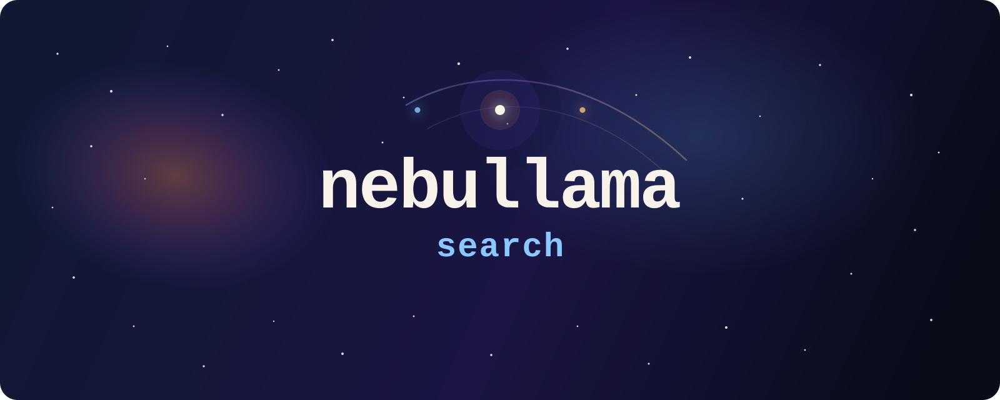

<p align="center">
  
</p>

<p align="center">
  
  
  
  
</p>

<p align="center">
  <em>
  Search five astronomical datasets by keyword, by meaning, or in plain English.
  Embeddings and query parsing run entirely on your machine.
  </em>
</p>

---

## Quick Start

**Prerequisites:** Java 21, Docker, Docker Compose

1. Start the infrastructure and pull Ollama models:

   ```bash
   docker-compose up -d
   ./scripts/init.sh
   ```

2. Start the service:

   ```bash
   cd service && ./gradlew bootRun
   ```

3. Verify the service is up:

   ```bash
   curl http://localhost:8080/actuator/health
   ```

   Expected: `{"status":"UP"}`

4. Ingest three documents:

   ```bash
   curl -X POST http://localhost:8080/api/v1/ingest/CELESTIAL_OBJECTS/bulk \
     -H "Content-Type: application/json" \
     -d '[
       {
         "name": "Crab Nebula",
         "object_type": "nebula",
         "description": "A supernova remnant in Taurus with a pulsar at its center",
         "constellation": "Taurus"
       },
       {
         "name": "Cassiopeia A",
         "object_type": "supernova remnant",
         "description": "A young supernova remnant in Cassiopeia and one of the brightest radio sources in the sky",
         "constellation": "Cassiopeia"
       },
       {
         "name": "Andromeda Galaxy",
         "object_type": "galaxy",
         "description": "A spiral galaxy and the nearest major galaxy to the Milky Way",
         "constellation": "Andromeda"
       }
     ]'
   ```

5. Run a semantic search that should return the two supernova remnants:

   ```bash
   curl -s -X POST http://localhost:8080/graphql \
     -H "Content-Type: application/json" \
     -d '{
        "query": "query($input: SearchInput!) { search(input: $input) { total hits { id resourceType score source } interpretation { searchMode } } }",
        "variables": {
          "input": {
            "query": "supernova remnant",
            "pagination": {
              "from": 0,
              "size": 2
            }
          }
        }
      }' | jq .
   ```

   Expected: two hits for `Crab Nebula` and `Cassiopeia A`, with
   `interpretation.searchMode` set to `SEMANTIC`.

6. Clear ingested documents from OpenSearch when you want a clean reset:

   ```bash
   curl -X POST "http://localhost:9200/celestial_objects,missions,observations,astronomers,publications/_delete_by_query" \
     -H "Content-Type: application/json" \
     -d '{"query":{"match_all":{}}}'
   ```

   This removes indexed documents but keeps the indexes, the local stack, and Ollama models in place.

---

## What You Can Do With It

If you search for "dying stars," you might miss a document that says "stellar
remnants." nebullama-search finds both by running keyword and semantic search
in parallel over five astronomical datasets. All embeddings and query
interpretation run locally via Ollama, with no cloud dependencies.

You can use it to:

- search across observations, missions, publications, astronomers, and celestial objects
- find relevant results even when the exact wording does not match
- ask in plain English and turn broad questions into structured search filters
- experiment with a local-first retrieval stack built with Java, OpenSearch, and Ollama

Example queries:

- `dying stars observed by Hubble`
- `missions launched by NASA after 2000`
- `papers about exoplanet atmospheres`

---

## Stack

| Concern | Technology |
| --- | --- |
| Service | Spring Boot 3.3, Java 21 |
| Search | OpenSearch 2.x (keyword and vector search) |
| Embeddings | Ollama + nomic-embed-text (768 dimensions) |
| Intent extraction | Ollama + mistral:7b |
| API | GraphQL (Spring for GraphQL) |
| Ingest | REST (Spring MVC) |
| Infrastructure | Docker Compose |

## Docs

Full documentation: [`docs/index.md`](docs/index.md)
