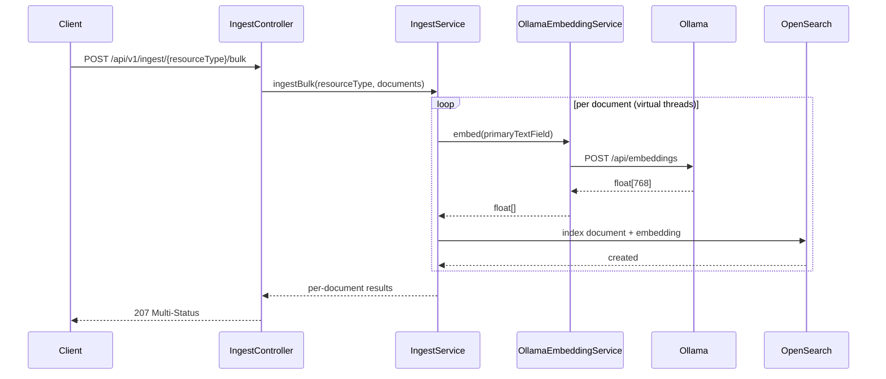

# Ingest Pipeline

Documents enter nebullama-search via REST. Embeddings are generated server-side by
calling Ollama before writing to OpenSearch.

## Primary text fields by index

| Index | Primary text field used for embedding |
| --- | --- |
| `celestial_objects` | `description` |
| `missions` | `description` |
| `observations` | `notes` |
| `astronomers` | `biography` |
| `publications` | `abstract` |

The `embedding` field is never accepted from clients; it is always generated server-side.
