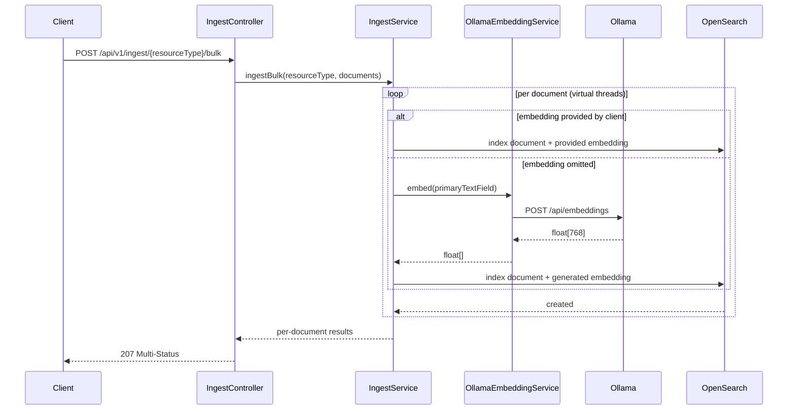

# Ingest Pipeline

Documents enter nebullama-search via REST. By default, embeddings are generated
server-side by calling Ollama before writing to OpenSearch. Clients may also send
precomputed embeddings, in which case the ingest path skips Ollama and writes the
provided vector directly.

## Primary text fields by index

| Index | Primary text field used for embedding |
| --- | --- |
| `celestial_objects` | `description` |
| `missions` | `description` |
| `observations` | `notes` |
| `astronomers` | `biography` |
| `publications` | `abstract` |

The `embedding` field is optional. If clients provide it, it must be a 768-value numeric array.
