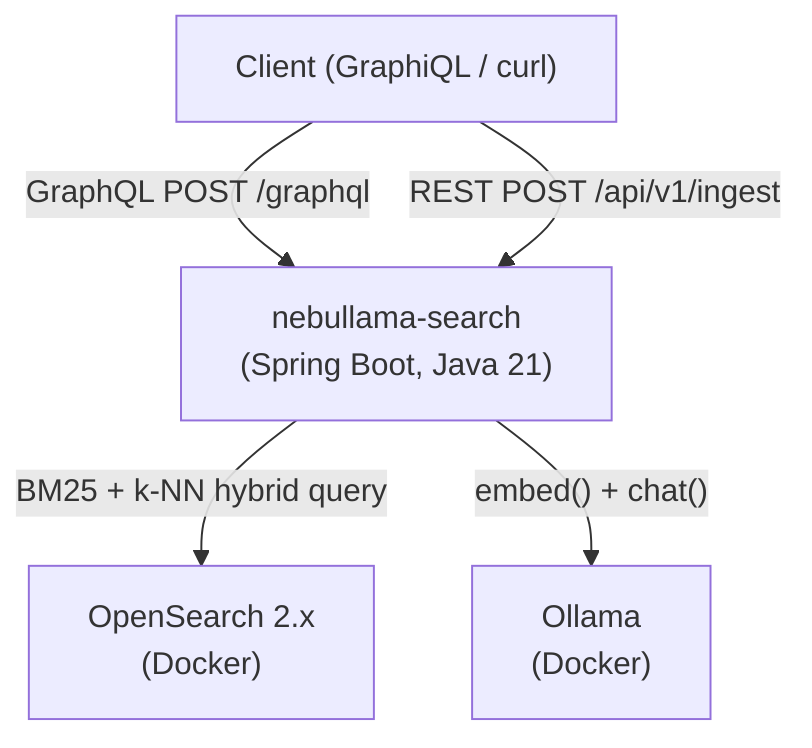

# Architecture Overview

nebullama-search is a Spring Boot 3.3 service (Java 21) that exposes a GraphQL search
API and a REST ingest API over five OpenSearch 2.x indexes of astronomy data. Embeddings
and LLM intent extraction are handled by Ollama running locally in Docker.

## Local stack

## Component responsibilities

| Component | Role |
| --- | --- |
| **Client** | GraphiQL browser UI or curl; sends GraphQL queries and REST ingest requests |
| **nebullama-search** | Runs intent extraction, builds OpenSearch queries, returns unified results |
| **OpenSearch 2.x** | Stores indexed documents; handles BM25 full-text and k-NN approximate-nearest-neighbor queries |
| **Ollama** | Serves `nomic-embed-text` for 768-dim embeddings and `mistral` for LLM chat (intent extraction) |

## Key design decisions

- Hybrid scoring uses OpenSearch's native `hybrid` query type with a
  `normalization-processor` search pipeline. BM25 and k-NN sub-queries are sent as a
  single request; the `hybrid-pipeline` normalizes and combines their scores with
  configurable weights (BM25=0.4, k-NN=0.6 by default).
- Intent extraction has a hard timeout (`search.intent-extraction.timeout-ms`) and
  falls back to a bare hybrid search if Ollama is slow or returns unparseable JSON.
- The Spring Boot service runs outside Docker so it can be hot-reloaded during
  development while OpenSearch and Ollama run as stable Docker containers.

## Indexes

| Index | Primary content | Embedding source field |
| --- | --- | --- |
| `celestial_objects` | Stars, nebulae, galaxies, pulsars | `description` |
| `missions` | Space missions | `description` |
| `observations` | Telescope observation records | `notes` |
| `astronomers` | Biographies of astronomers | `biography` |
| `publications` | Scientific papers | `abstract` |
