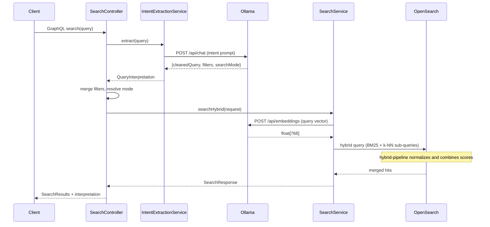

# Search Pipeline

Every `search` or `searchIndex` GraphQL call flows through this pipeline.

## Filter merge rules

`SearchController.mergeFilters()` applies these precedence rules:

1. **resourceTypes:** `searchIndex` forced value > explicit `input.filters.resourceTypes` >
   LLM-extracted `resourceTypeHints`
2. **All other filter fields** (`agency`, `objectType`, etc.): explicit `input.filters`
   value wins; if null, use LLM-extracted value if present
3. **searchMode:** taken from `QueryInterpretation.searchMode()`; if intent extraction is
   disabled or fell back, this is always `HYBRID`

## Search dispatch

`SearchController` dispatches to one of three `SearchService` methods based on the resolved
`searchMode`:

| Mode | Method | What it does |
| --- | --- | --- |
| `KEYWORD` | `searchBM25()` | Multi-match full-text across 8 fields, bool filter |
| `SEMANTIC` | `searchKNN()` | Embed query, k-NN approximate nearest neighbor search |
| `HYBRID` | `searchHybrid()` | Single hybrid query with BM25 + k-NN sub-queries, scored by `hybrid-pipeline` |

## Fallback behavior

If intent extraction times out or returns unparseable JSON, `IntentExtractionService`
returns `QueryInterpretation.fallback(rawQuery)`:

- `rewrittenQuery` = the original raw query string
- `extractedFilters` = empty map
- `searchMode` = HYBRID

The pipeline continues normally; the client sees a response with `searchMode: HYBRID` and
`rewrittenQuery` equal to what they typed.
