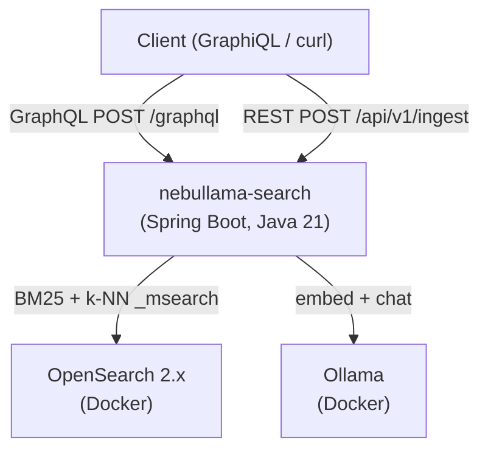

# nebullama-search Phase 1 — Infrastructure & Scaffolding

> **For agentic workers:** REQUIRED SUB-SKILL: Use superpowers:subagent-driven-development (recommended) or superpowers:executing-plans to implement this plan task-by-task. Steps use checkbox (`- [ ]`) syntax for tracking.

**Goal:** Stand up the full local dev infrastructure (Docker Compose, Spring Boot skeleton, OpenSearch indexes with k-NN mappings) and repo identity (Obsidian vault, README, SVG icon) so every subsequent phase has a working foundation to build on.

**Architecture:** Docker Compose runs OpenSearch 2.x (k-NN plugin enabled), OpenSearch Dashboards, and Ollama as separate containers with named volumes for persistence. The Spring Boot service runs locally via Gradle pointing at the Docker stack. OpenSearch indexes are created automatically at startup via an `ApplicationRunner` that reads mapping JSON from classpath resources. In-module tests use Testcontainers (real OpenSearch) + WireMock (stubbed Ollama returning a fixed 768-dim vector).

**Tech Stack:** Spring Boot 3.3.x, Java 21, Gradle Kotlin DSL 8.x, OpenSearch 2.13, opensearch-java 2.x, Testcontainers, WireMock, Docker Compose, Obsidian

---

## File Map

### New files — infrastructure
| File | Purpose |
|---|---|
| `docker-compose.yml` | OpenSearch, Dashboards, Ollama services with named volumes |
| `scripts/init.sh` | Pulls `nomic-embed-text` and `mistral:7b` into Ollama after startup |
| `.gitignore` | Covers Java/Gradle, IDE, Python venv, seed data files |

### New files — Spring Boot skeleton
| File | Purpose |
|---|---|
| `service/settings.gradle.kts` | Project name + subproject include |
| `service/build.gradle.kts` | Dependencies, Java 21 toolchain |
| `service/gradle/wrapper/gradle-wrapper.properties` | Gradle 8.x wrapper config |
| `service/src/main/resources/application.yml` | All config: OpenSearch, Ollama, search weights |
| `service/src/main/java/.../NebullamaSearchApplication.java` | `@SpringBootApplication` main class |
| `service/src/main/java/.../config/` | Package placeholder |
| `service/src/main/java/.../ingest/` | Package placeholder |
| `service/src/main/java/.../search/` | Package placeholder |
| `service/src/main/java/.../domain/` | Package placeholder |
| `service/src/main/java/.../util/` | Package placeholder |

### New files — OpenSearch mappings (T2)
| File | Purpose |
|---|---|
| `service/src/main/resources/opensearch/celestial_objects.json` | Index settings + field mappings incl. knn_vector |
| `service/src/main/resources/opensearch/missions.json` | Same |
| `service/src/main/resources/opensearch/observations.json` | Same |
| `service/src/main/resources/opensearch/astronomers.json` | Same |
| `service/src/main/resources/opensearch/publications.json` | Same |
| `service/src/main/java/.../domain/ResourceType.java` | Enum: CELESTIAL_OBJECTS → "celestial_objects", etc. |
| `service/src/main/java/.../domain/CelestialObject.java` | POJO matching celestial_objects fields |
| `service/src/main/java/.../domain/Mission.java` | POJO |
| `service/src/main/java/.../domain/Observation.java` | POJO |
| `service/src/main/java/.../domain/Astronomer.java` | POJO |
| `service/src/main/java/.../domain/Publication.java` | POJO |
| `service/src/main/java/.../config/OpenSearchProperties.java` | `@ConfigurationProperties(prefix="opensearch")` |
| `service/src/main/java/.../config/OpenSearchConfig.java` | `@Bean OpenSearchClient` |
| `service/src/main/java/.../config/IndexInitializer.java` | `ApplicationRunner` that creates indexes on startup |
| `service/src/test/java/.../config/IndexInitializerTest.java` | Testcontainers integration test |

### New files — docs & identity (T12, T13)
| File | Purpose |
|---|---|
| `docs/.obsidian/app.json` | Obsidian config: enable Mermaid, dark theme |
| `docs/.obsidian/core-plugins.json` | Enable graph, backlinks, tag-pane, etc. |
| `docs/index.md` | Vault home page linking all sections |
| `docs/assets/nebullama-icon.svg` | 64×64 pixel art llama-in-spacesuit placeholder |
| `docs/assets/README.md` | Midjourney prompt for final icon version |
| `docs/architecture/_index.md` | Section placeholder |
| `docs/architecture/overview.md` | Placeholder (filled in Phase 4) |
| `docs/architecture/search-pipeline.md` | Placeholder |
| `docs/architecture/ingest-pipeline.md` | Placeholder |
| `docs/architecture/aws-architecture.md` | Placeholder |
| `docs/concepts/_index.md` | Section placeholder |
| `docs/concepts/hybrid-search.md` | Placeholder (Phase 3) |
| `docs/concepts/vector-embeddings.md` | Placeholder (Phase 4) |
| `docs/concepts/intent-extraction.md` | Placeholder (Phase 4) |
| `docs/guides/_index.md` | Section placeholder |
| `docs/guides/local-dev-setup.md` | Full guide written in this phase |
| `docs/guides/data-ingestion.md` | Placeholder (Phase 2) |
| `docs/guides/running-searches.md` | Placeholder (Phase 4) |
| `docs/api-reference/_index.md` | Section placeholder |
| `docs/api-reference/graphql-schema.md` | Placeholder (Phase 4) |
| `docs/api-reference/ingest-rest-api.md` | Placeholder (Phase 2) |
| `docs/deployment/_index.md` | Section placeholder |
| `docs/deployment/aws.md` | Placeholder (Phase 5) |
| `README.md` | Root README with icon, quick start, stack table |

---

## Tasks

---

### Task 1: Obsidian Vault Shell (T12)

**Files:**
- Create: `docs/.obsidian/app.json`
- Create: `docs/.obsidian/core-plugins.json`
- Create: `docs/index.md`
- Create: all section `_index.md` placeholder files
- Create: all doc placeholder files listed in the file map above

- [ ] **Step 1: Create Obsidian config**

Create `docs/.obsidian/app.json`:
```json
{
  "theme": "obsidian",
  "defaultViewMode": "preview",
  "livePreview": true,
  "legacyEditor": false,
  "foldIndent": true,
  "showFrontmatter": false
}
```

Create `docs/.obsidian/core-plugins.json`:
```json
{
  "file-explorer": true,
  "global-search": true,
  "switcher": true,
  "graph": true,
  "backlink": true,
  "outgoing-link": true,
  "tag-pane": true,
  "page-preview": true,
  "starred": true,
  "markdown-importer": false,
  "zk-prefixer": false,
  "random-note": false,
  "outline": true,
  "word-count": true,
  "open-with-default-app": false,
  "file-recovery": true
}
```

- [ ] **Step 2: Create vault home page**

Create `docs/index.md`:
```markdown
# nebullama-search


A local-dev hybrid search service over astronomy data — a learning project for vector search, OpenSearch k-NN, and LLM-powered intent extraction.

---

## Sections

- [[architecture/overview|Architecture Overview]]
- [[concepts/hybrid-search|Hybrid Search]]
- [[concepts/vector-embeddings|Vector Embeddings]]
- [[concepts/intent-extraction|Intent Extraction]]
- [[guides/local-dev-setup|Local Dev Setup]]
- [[guides/data-ingestion|Data Ingestion]]
- [[guides/running-searches|Running Searches]]
- [[api-reference/graphql-schema|GraphQL Schema]]
- [[api-reference/ingest-rest-api|Ingest REST API]]
- [[deployment/aws|AWS Deployment]]

---

## Stack

| Concern | Technology |
|---|---|
| Service | Spring Boot 3.3, Java 21 |
| Search | OpenSearch 2.x (BM25 + k-NN) |
| Embeddings | Ollama + nomic-embed-text (768-dim) |
| Intent extraction | Ollama + mistral:7b |
| API | GraphQL (Spring for GraphQL) |
| Ingest | REST (Spring MVC) |
| Infrastructure | Docker Compose |
```

- [ ] **Step 3: Create section index placeholders**

For each of these files, use the template below (substituting title and description):

`docs/architecture/_index.md`:
```markdown
# Architecture

Architecture diagrams and design decisions for nebullama-search.

> 🚧 Diagrams are added as each component is implemented.
```

`docs/concepts/_index.md`:
```markdown
# Concepts

Deep-dives into the core technical concepts behind nebullama-search.

> 🚧 Filled in during Phase 3 (Search) and Phase 4 (Intelligence).
```

`docs/guides/_index.md`:
```markdown
# Guides

Step-by-step operational guides for running and using nebullama-search.
```

`docs/api-reference/_index.md`:
```markdown
# API Reference

Complete reference for the GraphQL and REST APIs.

> 🚧 Filled in during Phase 2 (Ingest) and Phase 4 (GraphQL).
```

`docs/deployment/_index.md`:
```markdown
# Deployment

Deployment guides for nebullama-search.

> 🚧 AWS deployment guide added in Phase 5.
```

- [ ] **Step 4: Create doc placeholder files**

Use this template for all placeholder doc files. Substitute the title and description.

`docs/architecture/overview.md`:
```markdown
# Architecture Overview

C4-style diagram of the full local nebullama-search stack.

> 🚧 Added in Phase 4 (GraphQL API ticket).
```

`docs/architecture/search-pipeline.md`:
```markdown
# Search Pipeline

Sequence diagram showing the full search request lifecycle.

> 🚧 Added in Phase 4 (GraphQL API ticket).
```

`docs/architecture/ingest-pipeline.md`:
```markdown
# Ingest Pipeline

Sequence diagram showing the ingest request lifecycle.

> 🚧 Added in Phase 2 (Ingest API ticket).
```

`docs/architecture/aws-architecture.md`:
```markdown
# AWS Architecture

Mermaid diagram of the AWS deployment topology.

> 🚧 Added in Phase 5 (AWS docs ticket).
```

`docs/concepts/hybrid-search.md`:
```markdown
# Hybrid Search

How BM25 and k-NN vector search are combined in nebullama-search.

> 🚧 Added in Phase 3 (Hybrid Search ticket).
```

`docs/concepts/vector-embeddings.md`:
```markdown
# Vector Embeddings

What embeddings are and how nomic-embed-text is used.

> 🚧 Added in Phase 4 (Intent Extraction ticket).
```

`docs/concepts/intent-extraction.md`:
```markdown
# Intent Extraction

How the LLM parses natural language queries into structured filters.

> 🚧 Added in Phase 4 (Intent Extraction ticket).
```

`docs/guides/data-ingestion.md`:
```markdown
# Data Ingestion

How to fetch seed data and bulk-ingest it into nebullama-search.

> 🚧 Added in Phase 2 (Seed Data + Ingest API tickets).
```

`docs/guides/running-searches.md`:
```markdown
# Running Searches

How to query nebullama-search via GraphiQL and curl.

> 🚧 Added in Phase 4 (GraphQL API ticket).
```

`docs/api-reference/graphql-schema.md`:
```markdown
# GraphQL Schema Reference

Full annotated GraphQL schema with example queries.

> 🚧 Added in Phase 4 (GraphQL API ticket).
```

`docs/api-reference/ingest-rest-api.md`:
```markdown
# Ingest REST API Reference

Endpoint reference with curl examples for all ingest operations.

> 🚧 Added in Phase 2 (Ingest API ticket).
```

`docs/deployment/aws.md`:
```markdown
# AWS Deployment

How to deploy nebullama-search to AWS using Bedrock, OpenSearch Serverless, and ECS Fargate.

> 🚧 Added in Phase 5 (AWS docs ticket).
```

- [ ] **Step 5: Commit**

```bash
git add docs/
git commit -m "feat: initialise Obsidian docs vault with structure and placeholders"
```

---

### Task 2: Project Logo & README (T13)

**Files:**
- Create: `docs/assets/nebullama-icon.svg`
- Create: `docs/assets/README.md`
- Create: `README.md`
- Modify: `docs/index.md` (already created)

- [ ] **Step 1: Create the placeholder SVG icon**

Create `docs/assets/nebullama-icon.svg`:
```svg
<svg xmlns="http://www.w3.org/2000/svg" viewBox="0 0 64 64" width="64" height="64" shape-rendering="crispEdges">
  <!-- Space background -->
  <rect width="64" height="64" fill="#0a0a1a"/>
  <!-- Stars -->
  <rect x="4" y="3" width="1" height="1" fill="#ffffff"/>
  <rect x="12" y="7" width="1" height="1" fill="#ccccff"/>
  <rect x="55" y="4" width="1" height="1" fill="#ffffff"/>
  <rect x="60" y="12" width="1" height="1" fill="#ccccff"/>
  <rect x="8" y="18" width="1" height="1" fill="#ffffff"/>
  <rect x="50" y="20" width="1" height="1" fill="#aaaaff"/>
  <rect x="2" y="55" width="1" height="1" fill="#ffffff"/>
  <rect x="58" y="50" width="1" height="1" fill="#ccccff"/>
  <!-- Nebula wisps (purples/pinks/teals) -->
  <rect x="0" y="10" width="8" height="3" fill="#6622aa" opacity="0.5"/>
  <rect x="1" y="12" width="6" height="2" fill="#aa44cc" opacity="0.4"/>
  <rect x="52" y="8" width="10" height="4" fill="#229988" opacity="0.5"/>
  <rect x="54" y="11" width="8" height="3" fill="#44bbaa" opacity="0.4"/>
  <rect x="0" y="45" width="12" height="4" fill="#cc44aa" opacity="0.4"/>
  <rect x="50" y="48" width="14" height="4" fill="#7733bb" opacity="0.4"/>
  <!-- Spacesuit body (white/light grey) -->
  <rect x="22" y="34" width="20" height="18" fill="#e0e0e8"/>
  <rect x="20" y="36" width="24" height="14" fill="#e8e8f0"/>
  <!-- Arms -->
  <rect x="16" y="36" width="6" height="12" fill="#d0d0dc"/>
  <rect x="42" y="36" width="6" height="12" fill="#d0d0dc"/>
  <!-- Gloves -->
  <rect x="15" y="47" width="7" height="4" fill="#c0c0cc"/>
  <rect x="42" y="47" width="7" height="4" fill="#c0c0cc"/>
  <!-- Legs -->
  <rect x="23" y="52" width="8" height="8" fill="#d0d0dc"/>
  <rect x="33" y="52" width="8" height="8" fill="#d0d0dc"/>
  <!-- Boots -->
  <rect x="22" y="58" width="9" height="4" fill="#aaaabc"/>
  <rect x="32" y="58" width="9" height="4" fill="#aaaabc"/>
  <!-- Llama neck -->
  <rect x="27" y="26" width="10" height="10" fill="#e8e0d0"/>
  <!-- Helmet (rounded rectangle approximation) -->
  <rect x="20" y="14" width="24" height="22" fill="#334455"/>
  <rect x="19" y="16" width="26" height="18" fill="#334455"/>
  <rect x="21" y="13" width="22" height="2" fill="#334455"/>
  <!-- Gold visor -->
  <rect x="22" y="18" width="20" height="12" fill="#c8960a"/>
  <rect x="23" y="17" width="18" height="14" fill="#daa520"/>
  <!-- Visor reflection (nebula in gold) -->
  <rect x="24" y="19" width="6" height="4" fill="#e8b830" opacity="0.7"/>
  <rect x="25" y="20" width="4" height="3" fill="#f0d060" opacity="0.5"/>
  <rect x="34" y="21" width="5" height="3" fill="#d4a020" opacity="0.6"/>
  <!-- Antenna -->
  <rect x="31" y="8" width="2" height="6" fill="#aaaabc"/>
  <rect x="30" y="7" width="4" height="2" fill="#ccccdd"/>
  <rect x="31" y="6" width="2" height="2" fill="#ff4444"/>
  <!-- Chest control panel -->
  <rect x="26" y="39" width="12" height="8" fill="#223344"/>
  <!-- Panel lights -->
  <rect x="27" y="40" width="2" height="2" fill="#ff4444"/>
  <rect x="30" y="40" width="2" height="2" fill="#44ff44"/>
  <rect x="33" y="40" width="2" height="2" fill="#4444ff"/>
  <rect x="27" y="43" width="2" height="2" fill="#ffff44"/>
  <rect x="30" y="43" width="4" height="2" fill="#334455"/>
  <rect x="35" y="43" width="2" height="2" fill="#ff8844"/>
  <!-- Collar ring -->
  <rect x="21" y="34" width="22" height="3" fill="#aaaabc"/>
</svg>
```

- [ ] **Step 2: Create assets README with Midjourney prompt**

Create `docs/assets/README.md`:
```markdown
# nebullama-search Assets

## Icon

`nebullama-icon.svg` — placeholder pixel art icon (hand-coded SVG).

`nebullama-icon.png` — final polished version (to be generated via Midjourney, add manually).

### Midjourney Prompt

> A cute llama wearing a NASA-style spacesuit with a gold reflective visor helmet, floating in deep space surrounded by a colorful nebula in purples, pinks, and teals. Pixel art style, 64x64 sprite, dark space background with scattered stars, retro game aesthetic, clean crisp pixels, warm gold visor reflection, small antenna on helmet, chest control panel with tiny colored lights. --style raw --ar 1:1 --v 6

Once generated, save as `docs/assets/nebullama-icon.png` and update `README.md` and `docs/index.md` to reference it.
```

- [ ] **Step 3: Create root README**

Create `README.md`:
```markdown
# nebullama-search


> Hybrid semantic search over astronomy data — a local-dev learning project for OpenSearch k-NN, vector embeddings, and LLM-powered intent extraction.


---

## What is this?

nebullama-search is a Spring Boot service that demonstrates hybrid search over five astronomy-themed OpenSearch indexes. A single natural language query like _"pulsars discovered by women"_ is parsed by a local LLM (Mistral 7B via Ollama) into structured filters, then executed as a combined BM25 + k-NN vector search. Results from all five indexes are merged and re-ranked by a configurable weighted score.

This is a learning project — the goal is to understand how vector search, embeddings, and LLM intent extraction work in practice, well enough to apply them in a production context.

---

## Architecture



---

## Quick Start

**Prerequisites:** Java 21, Docker, Docker Compose

```bash
# 1. Start infrastructure
docker-compose up -d

# 2. Pull Ollama models (run once)
./scripts/init.sh

# 3. Start the service
cd service && ./gradlew bootRun
```

Verify: `curl http://localhost:8080/actuator/health`

GraphiQL: http://localhost:8080/graphiql
OpenSearch Dashboards: http://localhost:5601

---

## Stack

| Concern | Technology |
|---|---|
| Service | Spring Boot 3.3, Java 21, virtual threads |
| Search | OpenSearch 2.x — BM25 + k-NN (cosine similarity, HNSW) |
| Embeddings | `nomic-embed-text` via Ollama (768-dim vectors) |
| Intent extraction | `mistral:7b` via Ollama |
| API | Spring for GraphQL |
| Ingest | Spring MVC REST |
| Infrastructure | Docker Compose |
| Build | Gradle (Kotlin DSL) |

---

## Docs

Full documentation lives in [`docs/`](docs/index.md) as an Obsidian vault.
Open the `docs/` directory in Obsidian for the best experience (Mermaid diagrams render natively).
```

- [ ] **Step 4: Commit**

```bash
git add docs/assets/ README.md
git commit -m "feat: add project README, placeholder SVG icon, and Midjourney prompt"
```

---

### Task 3: Docker Compose & Init Script (T1, part 1)

**Files:**
- Create: `docker-compose.yml`
- Create: `scripts/init.sh`
- Create: `.gitignore`

- [ ] **Step 1: Create docker-compose.yml**

Create `docker-compose.yml`:
```yaml
version: '3.8'

services:
  opensearch:
    image: opensearchproject/opensearch:2.13.0
    environment:
      - discovery.type=single-node
      - DISABLE_SECURITY_PLUGIN=true
      - OPENSEARCH_JAVA_OPTS=-Xms512m -Xmx512m
      - plugins.ml_commons.only_run_on_ml_node=false
    ports:
      - "9200:9200"
      - "9600:9600"
    volumes:
      - opensearch-data:/usr/share/opensearch/data
    healthcheck:
      test: ["CMD-SHELL", "curl -f http://localhost:9200/_cluster/health || exit 1"]
      interval: 15s
      timeout: 10s
      retries: 10
      start_period: 60s

  opensearch-dashboards:
    image: opensearchproject/opensearch-dashboards:2.13.0
    environment:
      - OPENSEARCH_HOSTS=["http://opensearch:9200"]
      - DISABLE_SECURITY_DASHBOARDS_PLUGIN=true
    ports:
      - "5601:5601"
    depends_on:
      opensearch:
        condition: service_healthy

  ollama:
    image: ollama/ollama:latest
    ports:
      - "11434:11434"
    volumes:
      - ollama-data:/root/.ollama

volumes:
  opensearch-data:
    name: nebullama-opensearch-data
  ollama-data:
    name: nebullama-ollama-data
```

- [ ] **Step 2: Create init.sh**

Create `scripts/init.sh`:
```bash
#!/usr/bin/env bash
set -euo pipefail

OLLAMA_URL="${OLLAMA_URL:-http://localhost:11434}"
MAX_WAIT=120
WAIT_INTERVAL=3

echo "Waiting for Ollama to be ready at ${OLLAMA_URL}..."
elapsed=0
until curl -sf "${OLLAMA_URL}/api/tags" > /dev/null 2>&1; do
  if [ "$elapsed" -ge "$MAX_WAIT" ]; then
    echo "ERROR: Ollama did not become ready within ${MAX_WAIT}s"
    exit 1
  fi
  sleep "$WAIT_INTERVAL"
  elapsed=$((elapsed + WAIT_INTERVAL))
done
echo "Ollama is ready."

pull_model() {
  local model="$1"
  echo "Checking model: ${model}..."
  if curl -sf "${OLLAMA_URL}/api/tags" | grep -q "\"${model}\""; then
    echo "  ${model} already present, skipping."
  else
    echo "  Pulling ${model}..."
    curl -sf -X POST "${OLLAMA_URL}/api/pull" \
      -H "Content-Type: application/json" \
      -d "{\"name\": \"${model}\"}" | tail -1
    echo "  Done."
  fi
}

pull_model "nomic-embed-text"
pull_model "mistral:7b"

echo "All models ready."
```

```bash
chmod +x scripts/init.sh
```

- [ ] **Step 3: Create .gitignore**

Create `.gitignore`:
```
# Java / Gradle
.gradle/
build/
*.class
*.jar
!gradle/wrapper/gradle-wrapper.jar
out/
.classpath
.project
.settings/

# IDE
.idea/
*.iml
*.iws
*.ipr
.vscode/
*.swp
*.swo

# Spring Boot
spring.log

# Python
venv/
.venv/
__pycache__/
*.pyc
*.pyo
.python-version
.env

# Seed data (generated — large files, not committed)
data/seed_*.json

# Docker volumes (local only)
volumes/

# OS
.DS_Store
Thumbs.db

# Obsidian workspace (local, not shared)
docs/.obsidian/workspace.json
docs/.obsidian/workspace-mobile.json
docs/.obsidian/cache
```

- [ ] **Step 4: Verify Docker Compose starts cleanly**

```bash
docker-compose up -d
docker-compose ps
```

Expected output: all three services in `running` or `healthy` state. OpenSearch takes ~30s to be healthy.

```bash
curl http://localhost:9200/_cluster/health
```

Expected: `{"status":"green",...}` or `{"status":"yellow",...}` (yellow is fine for single-node).

- [ ] **Step 5: Commit**

```bash
git add docker-compose.yml scripts/init.sh .gitignore
git commit -m "feat: add Docker Compose stack (OpenSearch, Dashboards, Ollama) and init script"
```

---

### Task 4: Spring Boot Project Scaffold (T1, part 2)

**Files:**
- Create: `service/settings.gradle.kts`
- Create: `service/build.gradle.kts`
- Create: `service/gradle/wrapper/gradle-wrapper.properties`
- Create: `service/src/main/resources/application.yml`
- Create: `service/src/main/java/com/example/nebullamasearch/NebullamaSearchApplication.java`
- Create: package-info placeholders for `config/`, `ingest/`, `search/`, `domain/`, `util/`

- [ ] **Step 1: Create settings.gradle.kts**

Create `service/settings.gradle.kts`:
```kotlin
rootProject.name = "nebullama-search"
```

- [ ] **Step 2: Create build.gradle.kts**

Create `service/build.gradle.kts`:
```kotlin
plugins {
    java
    id("org.springframework.boot") version "3.3.5"
    id("io.spring.dependency-management") version "1.1.6"
}

group = "com.example"
version = "0.0.1-SNAPSHOT"

java {
    toolchain {
        languageVersion = JavaLanguageVersion.of(21)
    }
}

repositories {
    mavenCentral()
}

dependencies {
    implementation("org.springframework.boot:spring-boot-starter-graphql")
    implementation("org.springframework.boot:spring-boot-starter-web")
    implementation("org.springframework.boot:spring-boot-starter-actuator")
    implementation("org.opensearch.client:opensearch-java:2.10.3")
    implementation("org.apache.httpcomponents.client5:httpclient5:5.3.1")
    implementation("com.fasterxml.jackson.core:jackson-databind")

    testImplementation("org.springframework.boot:spring-boot-starter-test")
    testImplementation("org.springframework:spring-webflux")
    testImplementation("org.testcontainers:testcontainers:1.19.8")
    testImplementation("org.testcontainers:junit-jupiter:1.19.8")
    testImplementation("org.wiremock:wiremock:3.5.4")
}

tasks.withType<Test> {
    useJUnitPlatform()
}
```

- [ ] **Step 3: Generate Gradle wrapper**

```bash
cd service
gradle wrapper --gradle-version 8.8
```

Expected: `gradle/wrapper/gradle-wrapper.jar`, `gradle/wrapper/gradle-wrapper.properties`, `gradlew`, `gradlew.bat` created.

- [ ] **Step 4: Create application.yml**

Create `service/src/main/resources/application.yml`:
```yaml
spring:
  threads:
    virtual:
      enabled: true
  graphql:
    graphiql:
      enabled: true

server:
  port: 8080

management:
  endpoints:
    web:
      exposure:
        include: health,info
  endpoint:
    health:
      show-details: always

opensearch:
  host: localhost
  port: 9200
  scheme: http

ollama:
  base-url: http://localhost:11434
  embedding-model: nomic-embed-text
  intent-model: mistral
  connect-timeout-ms: 5000
  read-timeout-ms: 10000

search:
  hybrid-weight:
    bm25: 0.4
    knn: 0.6
  knn-k: 10
  intent-extraction:
    enabled: true
    timeout-ms: 3000
```

- [ ] **Step 5: Create main application class**

Create `service/src/main/java/com/example/nebullamasearch/NebullamaSearchApplication.java`:
```java
package com.example.nebullamasearch;

import org.springframework.boot.SpringApplication;
import org.springframework.boot.autoconfigure.SpringBootApplication;

@SpringBootApplication
public class NebullamaSearchApplication {

    public static void main(String[] args) {
        SpringApplication.run(NebullamaSearchApplication.class, args);
    }
}
```

- [ ] **Step 6: Create package placeholder files**

Create one `package-info.java` per package so the directories exist in version control:

`service/src/main/java/com/example/nebullamasearch/config/package-info.java`:
```java
/** OpenSearch client, Ollama client, and index initializer beans. */
package com.example.nebullamasearch.config;
```

`service/src/main/java/com/example/nebullamasearch/ingest/package-info.java`:
```java
/** REST ingest controllers, ingest service, embedding service. */
package com.example.nebullamasearch.ingest;
```

`service/src/main/java/com/example/nebullamasearch/search/package-info.java`:
```java
/** GraphQL controllers, search service, intent extraction service. */
package com.example.nebullamasearch.search;
```

`service/src/main/java/com/example/nebullamasearch/domain/package-info.java`:
```java
/** Per-resource-type POJOs, ResourceType enum, index mapping constants. */
package com.example.nebullamasearch.domain;
```

`service/src/main/java/com/example/nebullamasearch/util/package-info.java`:
```java
/** JSON helpers and shared utility types. */
package com.example.nebullamasearch.util;
```

- [ ] **Step 7: Verify the project compiles and starts**

```bash
cd service
./gradlew bootRun
```

Expected: Spring Boot starts on port 8080, logs "Started NebullamaSearchApplication".

```bash
curl http://localhost:8080/actuator/health
```

Expected: `{"status":"UP"}`

- [ ] **Step 8: Commit**

```bash
cd ..
git add service/
git commit -m "feat: scaffold Spring Boot project with Gradle, application.yml, and package structure"
```

---

### Task 5: OpenSearch Mapping Files (T2, part 1)

**Files:**
- Create: `service/src/main/resources/opensearch/celestial_objects.json`
- Create: `service/src/main/resources/opensearch/missions.json`
- Create: `service/src/main/resources/opensearch/observations.json`
- Create: `service/src/main/resources/opensearch/astronomers.json`
- Create: `service/src/main/resources/opensearch/publications.json`

- [ ] **Step 1: Create celestial_objects mapping**

Create `service/src/main/resources/opensearch/celestial_objects.json`:
```json
{
  "settings": {
    "index": {
      "knn": true,
      "number_of_shards": 1,
      "number_of_replicas": 0
    }
  },
  "mappings": {
    "properties": {
      "resource_type":    { "type": "keyword" },
      "name":             { "type": "text" },
      "designations":     { "type": "text" },
      "object_type":      { "type": "keyword" },
      "constellation":    { "type": "keyword" },
      "distance_ly":      { "type": "double" },
      "description":      { "type": "text" },
      "discovered_by":    { "type": "keyword" },
      "discovery_year":   { "type": "integer" },
      "embedding": {
        "type": "knn_vector",
        "dimension": 768,
        "method": {
          "name": "hnsw",
          "space_type": "cosinesimil",
          "engine": "lucene",
          "parameters": {
            "ef_construction": 128,
            "m": 16
          }
        }
      }
    }
  }
}
```

- [ ] **Step 2: Create missions mapping**

Create `service/src/main/resources/opensearch/missions.json`:
```json
{
  "settings": {
    "index": {
      "knn": true,
      "number_of_shards": 1,
      "number_of_replicas": 0
    }
  },
  "mappings": {
    "properties": {
      "resource_type":  { "type": "keyword" },
      "name":           { "type": "text" },
      "agency":         { "type": "keyword" },
      "mission_type":   { "type": "keyword" },
      "launch_year":    { "type": "integer" },
      "status":         { "type": "keyword" },
      "targets":        { "type": "keyword" },
      "description":    { "type": "text" },
      "embedding": {
        "type": "knn_vector",
        "dimension": 768,
        "method": {
          "name": "hnsw",
          "space_type": "cosinesimil",
          "engine": "lucene",
          "parameters": {
            "ef_construction": 128,
            "m": 16
          }
        }
      }
    }
  }
}
```

- [ ] **Step 3: Create observations mapping**

Create `service/src/main/resources/opensearch/observations.json`:
```json
{
  "settings": {
    "index": {
      "knn": true,
      "number_of_shards": 1,
      "number_of_replicas": 0
    }
  },
  "mappings": {
    "properties": {
      "resource_type":      { "type": "keyword" },
      "target_name":        { "type": "text" },
      "instrument":         { "type": "keyword" },
      "observatory":        { "type": "keyword" },
      "observation_date":   { "type": "date" },
      "wavelength_band":    { "type": "keyword" },
      "notes":              { "type": "text" },
      "embedding": {
        "type": "knn_vector",
        "dimension": 768,
        "method": {
          "name": "hnsw",
          "space_type": "cosinesimil",
          "engine": "lucene",
          "parameters": {
            "ef_construction": 128,
            "m": 16
          }
        }
      }
    }
  }
}
```

- [ ] **Step 4: Create astronomers mapping**

Create `service/src/main/resources/opensearch/astronomers.json`:
```json
{
  "settings": {
    "index": {
      "knn": true,
      "number_of_shards": 1,
      "number_of_replicas": 0
    }
  },
  "mappings": {
    "properties": {
      "resource_type":        { "type": "keyword" },
      "name":                 { "type": "text" },
      "birth_year":           { "type": "integer" },
      "death_year":           { "type": "integer" },
      "nationality":          { "type": "keyword" },
      "known_for":            { "type": "text" },
      "associated_objects":   { "type": "keyword" },
      "associated_missions":  { "type": "keyword" },
      "biography":            { "type": "text" },
      "embedding": {
        "type": "knn_vector",
        "dimension": 768,
        "method": {
          "name": "hnsw",
          "space_type": "cosinesimil",
          "engine": "lucene",
          "parameters": {
            "ef_construction": 128,
            "m": 16
          }
        }
      }
    }
  }
}
```

- [ ] **Step 5: Create publications mapping**

Create `service/src/main/resources/opensearch/publications.json`:
```json
{
  "settings": {
    "index": {
      "knn": true,
      "number_of_shards": 1,
      "number_of_replicas": 0
    }
  },
  "mappings": {
    "properties": {
      "resource_type": { "type": "keyword" },
      "title":         { "type": "text" },
      "authors":       { "type": "keyword" },
      "year":          { "type": "integer" },
      "journal":       { "type": "keyword" },
      "abstract":      { "type": "text" },
      "topics":        { "type": "keyword" },
      "doi":           { "type": "keyword" },
      "embedding": {
        "type": "knn_vector",
        "dimension": 768,
        "method": {
          "name": "hnsw",
          "space_type": "cosinesimil",
          "engine": "lucene",
          "parameters": {
            "ef_construction": 128,
            "m": 16
          }
        }
      }
    }
  }
}
```

- [ ] **Step 6: Commit**

```bash
git add service/src/main/resources/opensearch/
git commit -m "feat: add OpenSearch index mapping files with k-NN vector fields (768-dim cosinesimil HNSW)"
```

---

### Task 6: ResourceType Enum & Domain POJOs (T2, part 2)

**Files:**
- Create: `service/src/main/java/com/example/nebullamasearch/domain/ResourceType.java`
- Create: `service/src/main/java/com/example/nebullamasearch/domain/CelestialObject.java`
- Create: `service/src/main/java/com/example/nebullamasearch/domain/Mission.java`
- Create: `service/src/main/java/com/example/nebullamasearch/domain/Observation.java`
- Create: `service/src/main/java/com/example/nebullamasearch/domain/Astronomer.java`
- Create: `service/src/main/java/com/example/nebullamasearch/domain/Publication.java`

- [ ] **Step 1: Create ResourceType enum**

Create `service/src/main/java/com/example/nebullamasearch/domain/ResourceType.java`:
```java
package com.example.nebullamasearch.domain;

import com.fasterxml.jackson.annotation.JsonCreator;
import com.fasterxml.jackson.annotation.JsonValue;

public enum ResourceType {

    CELESTIAL_OBJECTS("celestial_objects"),
    MISSIONS("missions"),
    OBSERVATIONS("observations"),
    ASTRONOMERS("astronomers"),
    PUBLICATIONS("publications");

    private final String indexName;

    ResourceType(String indexName) {
        this.indexName = indexName;
    }

    public String indexName() {
        return indexName;
    }

    @JsonValue
    public String toValue() {
        return name();
    }

    @JsonCreator
    public static ResourceType fromValue(String value) {
        for (ResourceType type : values()) {
            if (type.name().equalsIgnoreCase(value) || type.indexName.equalsIgnoreCase(value)) {
                return type;
            }
        }
        throw new IllegalArgumentException("Unknown ResourceType: " + value);
    }

    public static ResourceType fromIndexName(String indexName) {
        for (ResourceType type : values()) {
            if (type.indexName.equals(indexName)) {
                return type;
            }
        }
        throw new IllegalArgumentException("No ResourceType for index: " + indexName);
    }
}
```

- [ ] **Step 2: Create CelestialObject POJO**

Create `service/src/main/java/com/example/nebullamasearch/domain/CelestialObject.java`:
```java
package com.example.nebullamasearch.domain;

import com.fasterxml.jackson.annotation.JsonProperty;
import java.util.List;

public class CelestialObject {
    public String id;
    public String name;
    public List<String> designations;
    @JsonProperty("object_type")  public String objectType;
    public String constellation;
    @JsonProperty("distance_ly")  public Double distanceLy;
    public String description;
    @JsonProperty("discovered_by") public String discoveredBy;
    @JsonProperty("discovery_year") public Integer discoveryYear;
    @JsonProperty("resource_type") public String resourceType;
    public float[] embedding;
}
```

- [ ] **Step 3: Create Mission POJO**

Create `service/src/main/java/com/example/nebullamasearch/domain/Mission.java`:
```java
package com.example.nebullamasearch.domain;

import com.fasterxml.jackson.annotation.JsonProperty;
import java.util.List;

public class Mission {
    public String id;
    public String name;
    public String agency;
    @JsonProperty("mission_type")  public String missionType;
    @JsonProperty("launch_year")   public Integer launchYear;
    public String status;
    public List<String> targets;
    public String description;
    @JsonProperty("resource_type") public String resourceType;
    public float[] embedding;
}
```

- [ ] **Step 4: Create Observation POJO**

Create `service/src/main/java/com/example/nebullamasearch/domain/Observation.java`:
```java
package com.example.nebullamasearch.domain;

import com.fasterxml.jackson.annotation.JsonProperty;

public class Observation {
    public String id;
    @JsonProperty("target_name")     public String targetName;
    public String instrument;
    public String observatory;
    @JsonProperty("observation_date") public String observationDate;
    @JsonProperty("wavelength_band") public String wavelengthBand;
    public String notes;
    @JsonProperty("resource_type")   public String resourceType;
    public float[] embedding;
}
```

- [ ] **Step 5: Create Astronomer POJO**

Create `service/src/main/java/com/example/nebullamasearch/domain/Astronomer.java`:
```java
package com.example.nebullamasearch.domain;

import com.fasterxml.jackson.annotation.JsonProperty;
import java.util.List;

public class Astronomer {
    public String id;
    public String name;
    @JsonProperty("birth_year")          public Integer birthYear;
    @JsonProperty("death_year")          public Integer deathYear;
    public String nationality;
    @JsonProperty("known_for")           public String knownFor;
    @JsonProperty("associated_objects")  public List<String> associatedObjects;
    @JsonProperty("associated_missions") public List<String> associatedMissions;
    public String biography;
    @JsonProperty("resource_type")       public String resourceType;
    public float[] embedding;
}
```

- [ ] **Step 6: Create Publication POJO**

Create `service/src/main/java/com/example/nebullamasearch/domain/Publication.java`:
```java
package com.example.nebullamasearch.domain;

import com.fasterxml.jackson.annotation.JsonProperty;
import java.util.List;

public class Publication {
    public String id;
    public String title;
    public List<String> authors;
    public Integer year;
    public String journal;
    @JsonProperty("abstract") public String abstractText;
    public List<String> topics;
    public String doi;
    @JsonProperty("resource_type") public String resourceType;
    public float[] embedding;
}
```

- [ ] **Step 7: Verify compilation**

```bash
cd service && ./gradlew compileJava
```

Expected: `BUILD SUCCESSFUL`

- [ ] **Step 8: Commit**

```bash
git add service/src/main/java/com/example/nebullamasearch/domain/
git commit -m "feat: add ResourceType enum and domain POJOs for all five index types"
```

---

### Task 7: OpenSearch Client Config Bean (T2, part 3)

**Files:**
- Create: `service/src/main/java/com/example/nebullamasearch/config/OpenSearchProperties.java`
- Create: `service/src/main/java/com/example/nebullamasearch/config/OpenSearchConfig.java`

- [ ] **Step 1: Create OpenSearchProperties**

Create `service/src/main/java/com/example/nebullamasearch/config/OpenSearchProperties.java`:
```java
package com.example.nebullamasearch.config;

import org.springframework.boot.context.properties.ConfigurationProperties;
import org.springframework.stereotype.Component;

@Component
@ConfigurationProperties(prefix = "opensearch")
public class OpenSearchProperties {
    private String host = "localhost";
    private int port = 9200;
    private String scheme = "http";

    public String getHost() { return host; }
    public void setHost(String host) { this.host = host; }
    public int getPort() { return port; }
    public void setPort(int port) { this.port = port; }
    public String getScheme() { return scheme; }
    public void setScheme(String scheme) { this.scheme = scheme; }
}
```

- [ ] **Step 2: Create OpenSearchConfig**

Create `service/src/main/java/com/example/nebullamasearch/config/OpenSearchConfig.java`:
```java
package com.example.nebullamasearch.config;

import org.apache.hc.client5.http.auth.AuthScope;
import org.apache.hc.client5.http.auth.UsernamePasswordCredentials;
import org.apache.hc.client5.http.impl.auth.BasicCredentialsProvider;
import org.apache.hc.core5.http.HttpHost;
import org.opensearch.client.opensearch.OpenSearchClient;
import org.opensearch.client.transport.httpclient5.ApacheHttpClient5TransportBuilder;
import org.springframework.context.annotation.Bean;
import org.springframework.context.annotation.Configuration;

@Configuration
public class OpenSearchConfig {

    @Bean
    public OpenSearchClient openSearchClient(OpenSearchProperties props) {
        HttpHost host = new HttpHost(props.getScheme(), props.getHost(), props.getPort());
        var transport = ApacheHttpClient5TransportBuilder
                .builder(host)
                .build();
        return new OpenSearchClient(transport);
    }
}
```

- [ ] **Step 3: Enable ConfigurationProperties scanning**

Add `@ConfigurationPropertiesScan` to the main application class:

Modify `service/src/main/java/com/example/nebullamasearch/NebullamaSearchApplication.java`:
```java
package com.example.nebullamasearch;

import org.springframework.boot.SpringApplication;
import org.springframework.boot.autoconfigure.SpringBootApplication;
import org.springframework.boot.context.properties.ConfigurationPropertiesScan;

@SpringBootApplication
@ConfigurationPropertiesScan
public class NebullamaSearchApplication {

    public static void main(String[] args) {
        SpringApplication.run(NebullamaSearchApplication.class, args);
    }
}
```

- [ ] **Step 4: Verify startup with OpenSearch running**

With `docker-compose up -d` running:
```bash
cd service && ./gradlew bootRun
```

Expected: starts without `ConnectException`. No errors in log related to OpenSearch client initialization.

- [ ] **Step 5: Commit**

```bash
git add service/src/main/java/com/example/nebullamasearch/config/OpenSearchProperties.java \
        service/src/main/java/com/example/nebullamasearch/config/OpenSearchConfig.java \
        service/src/main/java/com/example/nebullamasearch/NebullamaSearchApplication.java
git commit -m "feat: add OpenSearch client config bean and properties binding"
```

---

### Task 8: IndexInitializer — test first (T2, part 4)

**Files:**
- Create: `service/src/test/java/com/example/nebullamasearch/config/IndexInitializerTest.java`
- Create: `service/src/main/java/com/example/nebullamasearch/config/IndexInitializer.java`

- [ ] **Step 1: Write the failing test**

Create `service/src/test/java/com/example/nebullamasearch/config/IndexInitializerTest.java`:
```java
package com.example.nebullamasearch.config;

import com.example.nebullamasearch.domain.ResourceType;
import org.junit.jupiter.api.Test;
import org.opensearch.client.opensearch.OpenSearchClient;
import org.springframework.beans.factory.annotation.Autowired;
import org.springframework.boot.test.context.SpringBootTest;
import org.springframework.test.context.DynamicPropertyRegistry;
import org.springframework.test.context.DynamicPropertySource;
import org.testcontainers.containers.GenericContainer;
import org.testcontainers.containers.wait.strategy.Wait;
import org.testcontainers.junit.jupiter.Container;
import org.testcontainers.junit.jupiter.Testcontainers;
import org.testcontainers.utility.DockerImageName;

import java.io.IOException;
import java.time.Duration;

import static org.junit.jupiter.api.Assertions.*;

@SpringBootTest
@Testcontainers
class IndexInitializerTest {

    @Container
    static GenericContainer<?> opensearch = new GenericContainer<>(
            DockerImageName.parse("opensearchproject/opensearch:2.13.0"))
            .withEnv("discovery.type", "single-node")
            .withEnv("DISABLE_SECURITY_PLUGIN", "true")
            .withEnv("OPENSEARCH_JAVA_OPTS", "-Xms512m -Xmx512m")
            .withExposedPorts(9200)
            .waitingFor(Wait.forHttp("/_cluster/health")
                    .forStatusCode(200)
                    .withStartupTimeout(Duration.ofMinutes(3)));

    @DynamicPropertySource
    static void opensearchProperties(DynamicPropertyRegistry registry) {
        registry.add("opensearch.host", opensearch::getHost);
        registry.add("opensearch.port", () -> opensearch.getMappedPort(9200));
        registry.add("opensearch.scheme", () -> "http");
        // Point Ollama at a non-existent port — IndexInitializer doesn't call Ollama
        registry.add("ollama.base-url", () -> "http://localhost:1");
    }

    @Autowired
    private OpenSearchClient client;

    @Autowired
    private IndexInitializer initializer;

    @Test
    void allFiveIndexesCreatedOnStartup() throws IOException {
        for (ResourceType type : ResourceType.values()) {
            boolean exists = client.indices()
                    .exists(r -> r.index(type.indexName()))
                    .value();
            assertTrue(exists, "Expected index '" + type.indexName() + "' to exist after startup");
        }
    }

    @Test
    void celestialObjectsIndexHasEmbeddingField() throws IOException {
        var response = client.indices().getMapping(r -> r.index("celestial_objects"));
        var properties = response.result().get("celestial_objects").mappings().properties();
        assertTrue(properties.containsKey("embedding"),
                "celestial_objects index should have an 'embedding' field");
    }

    @Test
    void startupIsIdempotentRunningTwiceDoesNotThrow() {
        assertDoesNotThrow(() -> initializer.run(null),
                "Running IndexInitializer a second time should not throw");
    }
}
```

- [ ] **Step 2: Run test — confirm it fails**

```bash
cd service && ./gradlew test --tests "*.IndexInitializerTest"
```

Expected: FAIL — `IndexInitializer` class does not exist yet.

- [ ] **Step 3: Implement IndexInitializer**

Create `service/src/main/java/com/example/nebullamasearch/config/IndexInitializer.java`:
```java
package com.example.nebullamasearch.config;

import com.example.nebullamasearch.domain.ResourceType;
import org.opensearch.client.opensearch.OpenSearchClient;
import org.slf4j.Logger;
import org.slf4j.LoggerFactory;
import org.springframework.boot.ApplicationArguments;
import org.springframework.boot.ApplicationRunner;
import org.springframework.stereotype.Component;

import java.io.IOException;
import java.io.InputStream;

@Component
public class IndexInitializer implements ApplicationRunner {

    private static final Logger log = LoggerFactory.getLogger(IndexInitializer.class);

    private final OpenSearchClient client;

    public IndexInitializer(OpenSearchClient client) {
        this.client = client;
    }

    @Override
    public void run(ApplicationArguments args) throws Exception {
        for (ResourceType type : ResourceType.values()) {
            createIndexIfAbsent(type.indexName());
        }
    }

    private void createIndexIfAbsent(String indexName) throws IOException {
        boolean exists = client.indices()
                .exists(r -> r.index(indexName))
                .value();

        if (exists) {
            log.info("Index '{}' already exists — skipping creation", indexName);
            return;
        }

        InputStream mappingJson = getClass()
                .getResourceAsStream("/opensearch/" + indexName + ".json");

        if (mappingJson == null) {
            throw new IllegalStateException(
                    "No mapping file found on classpath: /opensearch/" + indexName + ".json");
        }

        client.indices().create(r -> r.index(indexName).withJson(mappingJson));
        log.info("Created index '{}'", indexName);
    }
}
```

- [ ] **Step 4: Run tests — confirm they pass**

```bash
cd service && ./gradlew test --tests "*.IndexInitializerTest"
```

Expected: all three tests PASS. Note: first run downloads the OpenSearch Docker image (~1GB), subsequent runs use the cached image.

- [ ] **Step 5: Write local dev setup guide**

Fill in `docs/guides/local-dev-setup.md` (replacing the placeholder from Task 1):
```markdown
# Local Dev Setup

## Prerequisites

| Tool | Version | Install |
|---|---|---|
| Java | 21 | [sdkman.io](https://sdkman.io) — `sdk install java 21-tem` |
| Docker | 24+ | [docker.com](https://www.docker.com/get-started/) |
| Docker Compose | v2 | Included with Docker Desktop |
| Gradle | 8.x | Use the wrapper (`./gradlew`) — no install needed |
| Python | 3.11+ | Only needed for seed data script |

## Start the Infrastructure

```bash
docker-compose up -d
```

Wait ~30 seconds for OpenSearch to be healthy:
```bash
docker-compose ps
# opensearch should show "healthy"
```

## Pull Ollama Models (First Time Only)

```bash
./scripts/init.sh
```

This pulls `nomic-embed-text` (~270MB) and `mistral:7b` (~4GB). Run once; models persist in the `nebullama-ollama-data` Docker volume.

## Start the Service

```bash
cd service
./gradlew bootRun
```

## Verify Everything Works

```bash
# Service health
curl http://localhost:8080/actuator/health
# Expected: {"status":"UP"}

# OpenSearch cluster health
curl http://localhost:9200/_cluster/health
# Expected: {"status":"yellow"} or {"status":"green"}

# Verify indexes were created
curl http://localhost:9200/_cat/indices?v
# Expected: five indexes (celestial_objects, missions, observations, astronomers, publications)
```

Open in browser:
- **GraphiQL**: http://localhost:8080/graphiql
- **OpenSearch Dashboards**: http://localhost:5601

## Troubleshooting

**OpenSearch fails to start / OOM:**
Increase Docker memory to at least 4GB in Docker Desktop → Settings → Resources.

**Ollama model not found:**
Re-run `./scripts/init.sh`. If Ollama container isn't running, run `docker-compose up -d ollama` first.

**Port already in use:**
Check for conflicting services: `lsof -i :9200` or `lsof -i :8080`. Stop conflicting processes or change ports in `docker-compose.yml` and `application.yml`.

**Index not created on startup:**
Ensure OpenSearch is healthy before starting the service. The `ApplicationRunner` runs once at startup — if OpenSearch wasn't ready, restart the service: `./gradlew bootRun`.
```

- [ ] **Step 6: Commit**

```bash
cd ..
git add service/src/main/java/com/example/nebullamasearch/config/IndexInitializer.java \
        service/src/test/java/com/example/nebullamasearch/config/IndexInitializerTest.java \
        docs/guides/local-dev-setup.md
git commit -m "feat: implement IndexInitializer with Testcontainers integration test and local dev guide"
```

---

## Phase 1 Done — Verification Checklist

Before moving to Phase 2, verify:

- [ ] `docker-compose up -d` starts all three services (OpenSearch healthy, Dashboards accessible at :5601, Ollama at :11434)
- [ ] `./scripts/init.sh` pulls both models without error
- [ ] `cd service && ./gradlew bootRun` starts on port 8080
- [ ] `curl localhost:8080/actuator/health` → `{"status":"UP"}`
- [ ] `curl localhost:9200/_cat/indices?v` shows all 5 indexes
- [ ] `curl localhost:9200/celestial_objects/_mapping` shows `"type":"knn_vector"` with `"dimension":768`
- [ ] `./gradlew test` passes (including `IndexInitializerTest`)
- [ ] `docs/` opens as an Obsidian vault with no errors
- [ ] `README.md` renders correctly on GitHub

---

## What's Next

**Phase 2 — Data Pipeline** covers:
- T3: Seed data fetch script (Python — SIMBAD, NASA API, MAST, Wikipedia, ADS)
- T4: Ollama embedding service (Java)
- T5: REST ingest API (`/api/v1/ingest/{resourceType}` + bulk)
- T15: `scripts/ingest_seed.sh` convenience script
