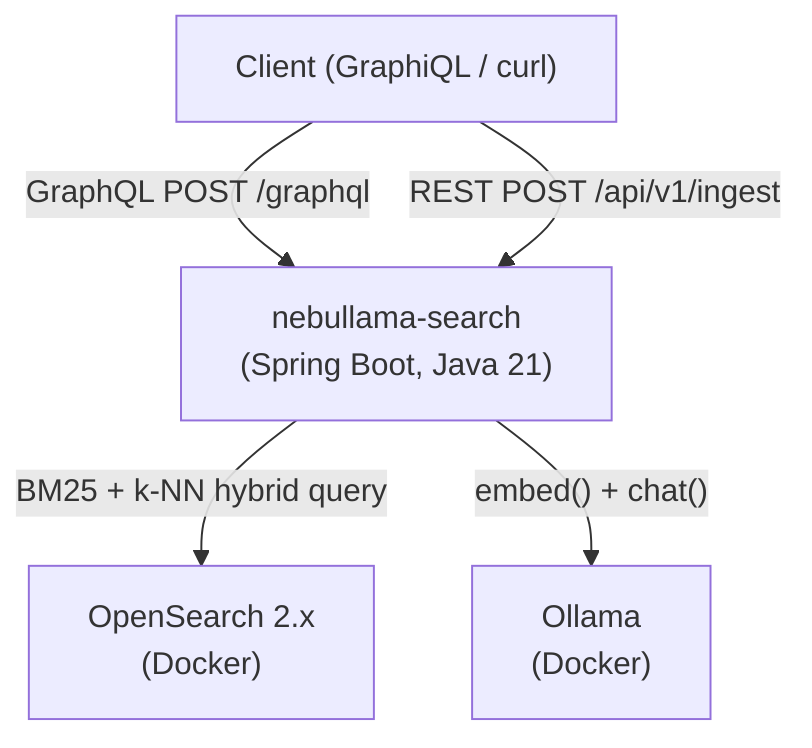
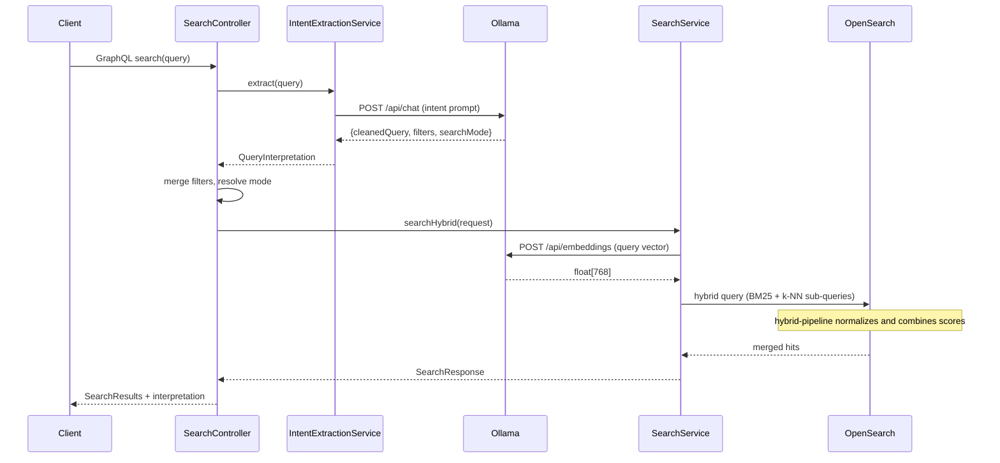
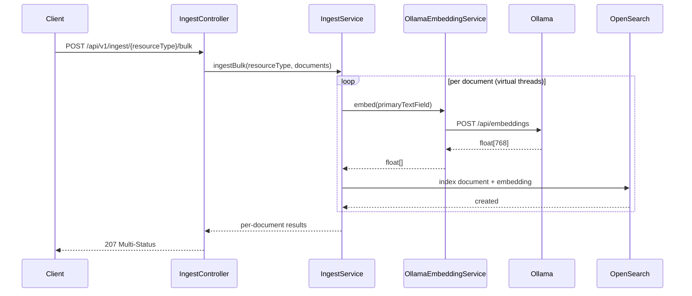

# GraphQL Search API Implementation Plan

> **For agentic workers:** REQUIRED SUB-SKILL: Use superpowers:subagent-driven-development
> (recommended) or superpowers:executing-plans to implement this plan task-by-task.
> Steps use checkbox (`- [ ]`) syntax for tracking.

**Goal:** Wire up GraphQL search API with full intent extraction, filter merge, search
dispatch, and results with interpretation metadata.

**Architecture:** Spring for GraphQL `@Controller` with two `@QueryMapping` methods
(`search`, `searchIndex`). Pipeline: extract intent via `IntentExtractionService`, merge
explicit and extracted filters (explicit wins), dispatch to BM25/k-NN/hybrid via
`SearchService`, return results with `QueryInterpretationResult`. Custom JSON scalar
handles arbitrary `source` and `extractedFilters` maps.

**Tech Stack:** Spring for GraphQL, Spring Boot 3.3.5, Java 21 records, graphql-java
custom scalar, HttpGraphQlTester for tests

---

## File Structure

**Create:**

- `service/src/main/resources/graphql/schema.graphqls`
- `service/src/main/java/com/example/nebullamasearch/util/JsonScalar.java`
- `service/src/main/java/com/example/nebullamasearch/config/GraphQLConfig.java`
- `service/src/main/java/com/example/nebullamasearch/search/dto/package-info.java`
- `service/src/main/java/com/example/nebullamasearch/search/dto/SearchInputDto.java`
- `service/src/main/java/com/example/nebullamasearch/search/dto/SearchFiltersDto.java`
- `service/src/main/java/com/example/nebullamasearch/search/dto/PaginationDto.java`
- `service/src/main/java/com/example/nebullamasearch/search/dto/SearchResultsDto.java`
- `service/src/main/java/com/example/nebullamasearch/search/dto/SearchHitDto.java`
- `service/src/main/java/com/example/nebullamasearch/search/dto/QueryInterpretationResultDto.java`
- `service/src/main/java/com/example/nebullamasearch/search/SearchController.java`
- `service/src/test/java/com/example/nebullamasearch/search/SearchControllerTest.java`

**Modify:**

- `service/build.gradle.kts` (add `spring-graphql-test` test dependency)
- `docs/architecture/overview.md` (replace placeholder)
- `docs/architecture/search-pipeline.md` (replace placeholder)
- `docs/architecture/ingest-pipeline.md` (replace placeholder)
- `docs/api-reference/graphql-schema.md` (replace placeholder)
- `docs/guides/running-searches.md` (replace placeholder)

**Already done (skip):**

- GraphiQL enabled in `application.yml` (already `spring.graphql.graphiql.enabled: true`)
- `docs/concepts/vector-embeddings.md` (already has real content)
- `docs/concepts/intent-extraction.md` (already has real content)

## Critical notes from existing code

1. **`SearchFilters` has 8 fields, NOT 10.** No `resourceTypes` parameter. Resource types
   live on `SearchRequest` as its second component. The original phase-4 plan's Task 8
   incorrectly passes `resourceTypes` to the `SearchFilters` constructor.
2. **`SearchResponse.total` is `long`.** Cast to `int` when building `SearchResultsDto`
   (GraphQL `Int!` is 32-bit).
3. **`IndexInitializer` must be mocked in test.** It's an `ApplicationRunner` that
   connects to OpenSearch on startup. Without mocking, `@SpringBootTest` context fails.
4. **Code style:** All local variables `final`. No `final` on parameters. No `var`.
   Google Java Format via Spotless.
5. **Commit format:** `Issue #14: <message>` (max 72 chars).

---

### Task 1: GraphQL schema, JSON scalar, and config

**Files:**

- Create: `service/src/main/resources/graphql/schema.graphqls`
- Create: `service/src/main/java/com/example/nebullamasearch/util/JsonScalar.java`
- Create: `service/src/main/java/com/example/nebullamasearch/config/GraphQLConfig.java`

- [ ] **Step 1: Write the GraphQL schema**

Create `service/src/main/resources/graphql/schema.graphqls`:

```graphql
scalar JSON

type Query {
  search(input: SearchInput!): SearchResults!
  searchIndex(resourceType: ResourceType!, input: SearchInput!): SearchResults!
}

input SearchInput {
  query: String!
  filters: SearchFilters
  pagination: Pagination
}

input SearchFilters {
  resourceTypes: [ResourceType!]
  objectType: String
  agency: String
  status: String
  wavelengthBand: String
  journal: String
  nationality: String
  yearFrom: Int
  yearTo: Int
}

input Pagination {
  from: Int = 0
  size: Int = 10
}

enum ResourceType {
  CELESTIAL_OBJECTS
  MISSIONS
  OBSERVATIONS
  ASTRONOMERS
  PUBLICATIONS
}

type SearchResults {
  total: Int!
  hits: [SearchHit!]!
  interpretation: QueryInterpretationResult
}

type SearchHit {
  id: String!
  resourceType: ResourceType!
  score: Float!
  source: JSON!
}

type QueryInterpretationResult {
  rewrittenQuery: String
  extractedFilters: JSON
  searchMode: SearchMode!
}

enum SearchMode {
  KEYWORD
  SEMANTIC
  HYBRID
}
```

- [ ] **Step 2: Create `JsonScalar`**

Create `service/src/main/java/com/example/nebullamasearch/util/JsonScalar.java`:

```java
package com.example.nebullamasearch.util;

import graphql.language.ArrayValue;
import graphql.language.BooleanValue;
import graphql.language.FloatValue;
import graphql.language.IntValue;
import graphql.language.NullValue;
import graphql.language.ObjectField;
import graphql.language.ObjectValue;
import graphql.language.StringValue;
import graphql.language.Value;
import graphql.schema.Coercing;
import graphql.schema.GraphQLScalarType;
import java.util.LinkedHashMap;
import java.util.Map;
import java.util.stream.Collectors;

public final class JsonScalar {

  public static final GraphQLScalarType JSON =
      GraphQLScalarType.newScalar()
          .name("JSON")
          .description("Arbitrary JSON value")
          .coercing(
              new Coercing<Object, Object>() {
                @Override
                public Object serialize(Object dataFetcherResult) {
                  return dataFetcherResult;
                }

                @Override
                public Object parseValue(Object input) {
                  return input;
                }

                @Override
                public Object parseLiteral(Object input) {
                  return parseLiteralValue((Value<?>) input);
                }

                private Object parseLiteralValue(Value<?> value) {
                  if (value instanceof NullValue) return null;
                  if (value instanceof BooleanValue bv) return bv.isValue();
                  if (value instanceof IntValue iv) return iv.getValue().intValueExact();
                  if (value instanceof FloatValue fv) return fv.getValue().doubleValue();
                  if (value instanceof StringValue sv) return sv.getValue();
                  if (value instanceof ArrayValue av) {
                    return av.getValues().stream()
                        .map(this::parseLiteralValue)
                        .collect(Collectors.toList());
                  }
                  if (value instanceof ObjectValue ov) {
                    final Map<String, Object> map = new LinkedHashMap<>();
                    for (ObjectField field : ov.getObjectFields()) {
                      map.put(field.getName(), parseLiteralValue(field.getValue()));
                    }
                    return map;
                  }
                  throw new IllegalArgumentException(
                      "Unsupported literal type: " + value.getClass());
                }
              })
          .build();

  private JsonScalar() {}
}
```

- [ ] **Step 3: Create `GraphQLConfig`**

Create `service/src/main/java/com/example/nebullamasearch/config/GraphQLConfig.java`:

```java
package com.example.nebullamasearch.config;

import com.example.nebullamasearch.util.JsonScalar;
import org.springframework.context.annotation.Bean;
import org.springframework.context.annotation.Configuration;
import org.springframework.graphql.execution.RuntimeWiringConfigurer;

@Configuration
public class GraphQLConfig {

  @Bean
  public RuntimeWiringConfigurer runtimeWiringConfigurer() {
    return wiringBuilder -> wiringBuilder.scalar(JsonScalar.JSON);
  }
}
```

- [ ] **Step 4: Compile check**

Run: `cd service && ./gradlew compileJava`
Expected: BUILD SUCCESSFUL

- [ ] **Step 5: Commit**

```bash
git add service/src/main/resources/graphql/schema.graphqls \
  service/src/main/java/com/example/nebullamasearch/util/JsonScalar.java \
  service/src/main/java/com/example/nebullamasearch/config/GraphQLConfig.java
git commit -m "Issue #14: add GraphQL schema, JSON scalar, and config"
```

---

### Task 2: GraphQL DTOs

**Files:**

- Create: `service/src/main/java/com/example/nebullamasearch/search/dto/package-info.java`
- Create: `service/src/main/java/com/example/nebullamasearch/search/dto/SearchInputDto.java`
- Create: `service/src/main/java/com/example/nebullamasearch/search/dto/SearchFiltersDto.java`
- Create: `service/src/main/java/com/example/nebullamasearch/search/dto/PaginationDto.java`
- Create: `service/src/main/java/com/example/nebullamasearch/search/dto/SearchResultsDto.java`
- Create: `service/src/main/java/com/example/nebullamasearch/search/dto/SearchHitDto.java`
- Create: `service/src/main/java/com/example/nebullamasearch/search/dto/QueryInterpretationResultDto.java`

Spring for GraphQL maps GraphQL input types to Java records by matching field names.
The DTO type names do not need to match the GraphQL type names.

- [ ] **Step 1: Create package-info and input DTOs**

Create `service/src/main/java/com/example/nebullamasearch/search/dto/package-info.java`:

```java
/** GraphQL input and output DTOs. */
package com.example.nebullamasearch.search.dto;
```

Create `service/src/main/java/com/example/nebullamasearch/search/dto/SearchInputDto.java`:

```java
package com.example.nebullamasearch.search.dto;

public record SearchInputDto(String query, SearchFiltersDto filters, PaginationDto pagination) {}
```

Create `service/src/main/java/com/example/nebullamasearch/search/dto/SearchFiltersDto.java`:

```java
package com.example.nebullamasearch.search.dto;

import com.example.nebullamasearch.domain.ResourceType;
import java.util.List;

public record SearchFiltersDto(
    List<ResourceType> resourceTypes,
    String objectType,
    String agency,
    String status,
    String wavelengthBand,
    String journal,
    String nationality,
    Integer yearFrom,
    Integer yearTo) {}
```

Note: `SearchFiltersDto` has `resourceTypes` (from the GraphQL input type), but the
domain `SearchFilters` record does NOT. The controller extracts `resourceTypes` from the
DTO and passes it to `SearchRequest` separately.

Create `service/src/main/java/com/example/nebullamasearch/search/dto/PaginationDto.java`:

```java
package com.example.nebullamasearch.search.dto;

public record PaginationDto(Integer from, Integer size) {

  public int resolvedFrom() {
    return from != null ? from : 0;
  }

  public int resolvedSize() {
    return size != null ? size : 10;
  }
}
```

- [ ] **Step 2: Create output DTOs**

Create `service/src/main/java/com/example/nebullamasearch/search/dto/QueryInterpretationResultDto.java`:

```java
package com.example.nebullamasearch.search.dto;

import com.example.nebullamasearch.search.SearchMode;
import java.util.Map;

public record QueryInterpretationResultDto(
    String rewrittenQuery, Map<String, Object> extractedFilters, SearchMode searchMode) {}
```

Create `service/src/main/java/com/example/nebullamasearch/search/dto/SearchHitDto.java`:

```java
package com.example.nebullamasearch.search.dto;

import com.example.nebullamasearch.domain.ResourceType;
import java.util.Map;

public record SearchHitDto(
    String id, ResourceType resourceType, float score, Map<String, Object> source) {}
```

Create `service/src/main/java/com/example/nebullamasearch/search/dto/SearchResultsDto.java`:

```java
package com.example.nebullamasearch.search.dto;

import java.util.List;

public record SearchResultsDto(
    int total, List<SearchHitDto> hits, QueryInterpretationResultDto interpretation) {}
```

- [ ] **Step 3: Compile check**

Run: `cd service && ./gradlew compileJava`
Expected: BUILD SUCCESSFUL

- [ ] **Step 4: Commit**

```bash
git add service/src/main/java/com/example/nebullamasearch/search/dto/
git commit -m "Issue #14: add GraphQL input and output DTO records"
```

---

### Task 3: SearchControllerTest (red)

**Files:**

- Modify: `service/build.gradle.kts`
- Create: `service/src/test/java/com/example/nebullamasearch/search/SearchControllerTest.java`

- [ ] **Step 1: Add test dependency**

Add to the `dependencies` block in `service/build.gradle.kts`:

```kotlin
testImplementation("org.springframework.graphql:spring-graphql-test")
```

`HttpGraphQlTester` lives in this module. The version is managed by Spring Boot's
dependency management plugin.

- [ ] **Step 2: Write the test**

Create `service/src/test/java/com/example/nebullamasearch/search/SearchControllerTest.java`:

```java
package com.example.nebullamasearch.search;

import static org.mockito.ArgumentMatchers.any;
import static org.mockito.ArgumentMatchers.argThat;
import static org.mockito.Mockito.verify;
import static org.mockito.Mockito.when;

import com.example.nebullamasearch.config.IndexInitializer;
import com.example.nebullamasearch.domain.ResourceType;
import java.util.List;
import java.util.Map;
import org.junit.jupiter.api.Test;
import org.springframework.beans.factory.annotation.Autowired;
import org.springframework.boot.test.autoconfigure.graphql.tester.AutoConfigureHttpGraphQlTester;
import org.springframework.boot.test.context.SpringBootTest;
import org.springframework.boot.test.mock.mockito.MockBean;
import org.springframework.graphql.test.tester.HttpGraphQlTester;

@SpringBootTest(webEnvironment = SpringBootTest.WebEnvironment.RANDOM_PORT)
@AutoConfigureHttpGraphQlTester
class SearchControllerTest {

  @Autowired HttpGraphQlTester tester;

  @MockBean SearchService searchService;

  @MockBean IntentExtractionService intentService;

  @MockBean IndexInitializer indexInitializer;

  private static final SearchResponse EMPTY_RESPONSE = new SearchResponse(0, List.of());

  @Test
  void searchUsesHybridByDefault() {
    when(intentService.extract(any()))
        .thenReturn(new QueryInterpretation("pulsars", Map.of(), SearchMode.HYBRID));
    when(searchService.searchHybrid(any())).thenReturn(EMPTY_RESPONSE);

    tester
        .document(
            """
            query {
              search(input: { query: "pulsars" }) {
                total
              }
            }
            """)
        .execute()
        .path("search.total")
        .entity(Integer.class)
        .isEqualTo(0);

    verify(searchService).searchHybrid(any());
  }

  @Test
  void searchUsesBm25WhenKeywordMode() {
    when(intentService.extract(any()))
        .thenReturn(new QueryInterpretation("Crab Nebula", Map.of(), SearchMode.KEYWORD));
    when(searchService.searchBM25(any())).thenReturn(EMPTY_RESPONSE);

    tester
        .document(
            """
            query {
              search(input: { query: "Crab Nebula" }) {
                total
              }
            }
            """)
        .execute()
        .path("search.total")
        .entity(Integer.class)
        .isEqualTo(0);

    verify(searchService).searchBM25(any());
  }

  @Test
  void searchIndexForcesResourceType() {
    when(intentService.extract(any()))
        .thenReturn(new QueryInterpretation("pulsar", Map.of(), SearchMode.HYBRID));
    when(searchService.searchHybrid(any())).thenReturn(EMPTY_RESPONSE);

    tester
        .document(
            """
            query {
              searchIndex(resourceType: ASTRONOMERS, input: { query: "pulsar" }) {
                total
              }
            }
            """)
        .execute()
        .path("searchIndex.total")
        .entity(Integer.class)
        .isEqualTo(0);

    verify(searchService)
        .searchHybrid(
            argThat(req -> req.resourceTypes().equals(List.of(ResourceType.ASTRONOMERS))));
  }

  @Test
  void interpretationIncludedInResponse() {
    when(intentService.extract(any()))
        .thenReturn(
            new QueryInterpretation(
                "Jupiter missions", Map.of("agency", "NASA"), SearchMode.HYBRID));
    when(searchService.searchHybrid(any())).thenReturn(EMPTY_RESPONSE);

    tester
        .document(
            """
            query {
              search(input: { query: "Jupiter missions" }) {
                total
                interpretation {
                  rewrittenQuery
                  searchMode
                  extractedFilters
                }
              }
            }
            """)
        .execute()
        .path("search.interpretation.rewrittenQuery")
        .entity(String.class)
        .isEqualTo("Jupiter missions")
        .path("search.interpretation.searchMode")
        .entity(String.class)
        .isEqualTo("HYBRID");
  }

  @Test
  void explicitFiltersOverrideExtracted() {
    when(intentService.extract(any()))
        .thenReturn(
            new QueryInterpretation("missions", Map.of("agency", "NASA"), SearchMode.HYBRID));
    when(searchService.searchHybrid(any())).thenReturn(EMPTY_RESPONSE);

    tester
        .document(
            """
            query {
              search(input: {
                query: "missions",
                filters: { agency: "ESA" }
              }) {
                total
              }
            }
            """)
        .execute()
        .path("search.total")
        .entity(Integer.class)
        .isEqualTo(0);

    verify(searchService)
        .searchHybrid(argThat(req -> "ESA".equals(req.filters().agency())));
  }

  @Test
  void paginationPassedThrough() {
    when(intentService.extract(any()))
        .thenReturn(new QueryInterpretation("galaxy", Map.of(), SearchMode.HYBRID));
    when(searchService.searchHybrid(any())).thenReturn(EMPTY_RESPONSE);

    tester
        .document(
            """
            query {
              search(input: {
                query: "galaxy",
                pagination: { from: 5, size: 3 }
              }) {
                total
              }
            }
            """)
        .execute()
        .path("search.total")
        .entity(Integer.class)
        .isEqualTo(0);

    verify(searchService)
        .searchHybrid(
            argThat(req -> req.pagination().from() == 5 && req.pagination().size() == 3));
  }
}
```

Key differences from the original phase-4 plan:

- Adds `@MockBean IndexInitializer indexInitializer` to prevent startup OpenSearch
  connection failure
- Uses Spotless-compatible formatting (Google Java Format)

- [ ] **Step 3: Run tests to verify they fail**

Run: `cd service && ./gradlew test --tests "com.example.nebullamasearch.search.SearchControllerTest"`

Expected: all 6 tests FAIL. Error will be something like
`No mapping found for GraphQL query 'search'` because `SearchController` does not exist yet.

- [ ] **Step 4: Commit**

```bash
git add service/build.gradle.kts \
  service/src/test/java/com/example/nebullamasearch/search/SearchControllerTest.java
git commit -m "Issue #14: add SearchControllerTest (red, no controller)"
```

---

### Task 4: SearchController (green)

**Files:**

- Create: `service/src/main/java/com/example/nebullamasearch/search/SearchController.java`

- [ ] **Step 1: Create `SearchController`**

Create `service/src/main/java/com/example/nebullamasearch/search/SearchController.java`:

```java
package com.example.nebullamasearch.search;

import com.example.nebullamasearch.domain.ResourceType;
import com.example.nebullamasearch.search.dto.PaginationDto;
import com.example.nebullamasearch.search.dto.QueryInterpretationResultDto;
import com.example.nebullamasearch.search.dto.SearchFiltersDto;
import com.example.nebullamasearch.search.dto.SearchHitDto;
import com.example.nebullamasearch.search.dto.SearchInputDto;
import com.example.nebullamasearch.search.dto.SearchResultsDto;
import java.util.List;
import java.util.Map;
import org.springframework.graphql.data.method.annotation.Argument;
import org.springframework.graphql.data.method.annotation.QueryMapping;
import org.springframework.stereotype.Controller;

@Controller
public class SearchController {

  private final IntentExtractionService intentService;
  private final SearchService searchService;

  public SearchController(
      IntentExtractionService intentService, SearchService searchService) {
    this.intentService = intentService;
    this.searchService = searchService;
  }

  @QueryMapping
  public SearchResultsDto search(@Argument SearchInputDto input) {
    return executeSearch(input, null);
  }

  @QueryMapping
  public SearchResultsDto searchIndex(
      @Argument ResourceType resourceType, @Argument SearchInputDto input) {
    return executeSearch(input, List.of(resourceType));
  }

  private SearchResultsDto executeSearch(
      SearchInputDto input, List<ResourceType> forcedResourceTypes) {
    final QueryInterpretation interpretation = intentService.extract(input.query());

    final List<ResourceType> resourceTypes =
        resolveResourceTypes(
            forcedResourceTypes,
            input.filters() != null ? input.filters().resourceTypes() : null,
            interpretation);

    final SearchFilters mergedFilters = mergeFilters(input.filters(), interpretation);
    final SearchMode mode = interpretation.searchMode();
    final Pagination pagination = toPagination(input.pagination());

    final SearchRequest request =
        new SearchRequest(interpretation.rewrittenQuery(), resourceTypes, mergedFilters, pagination);

    final SearchResponse response =
        switch (mode) {
          case KEYWORD -> searchService.searchBM25(request);
          case SEMANTIC -> searchService.searchKNN(request);
          case HYBRID -> searchService.searchHybrid(request);
        };

    return toResultsDto(response, interpretation);
  }

  /**
   * Precedence: forced (searchIndex) > explicit input.filters.resourceTypes > extracted hints.
   */
  @SuppressWarnings("unchecked")
  private List<ResourceType> resolveResourceTypes(
      List<ResourceType> forced,
      List<ResourceType> explicit,
      QueryInterpretation interpretation) {
    if (forced != null && !forced.isEmpty()) {
      return forced;
    }
    if (explicit != null && !explicit.isEmpty()) {
      return explicit;
    }
    final List<ResourceType> hints =
        (List<ResourceType>) interpretation.extractedFilters().get("resourceTypeHints");
    if (hints != null && !hints.isEmpty()) {
      return hints;
    }
    return List.of();
  }

  private SearchFilters mergeFilters(
      SearchFiltersDto explicit, QueryInterpretation interpretation) {
    final Map<String, Object> extracted = interpretation.extractedFilters();

    final String objectType =
        firstNonNull(
            explicit != null ? explicit.objectType() : null, extracted.get("objectType"));
    final String agency =
        firstNonNull(explicit != null ? explicit.agency() : null, extracted.get("agency"));
    final String status =
        firstNonNull(explicit != null ? explicit.status() : null, extracted.get("status"));
    final String wavelengthBand =
        firstNonNull(
            explicit != null ? explicit.wavelengthBand() : null,
            extracted.get("wavelengthBand"));
    final String journal =
        firstNonNull(explicit != null ? explicit.journal() : null, extracted.get("journal"));
    final String nationality =
        firstNonNull(
            explicit != null ? explicit.nationality() : null, extracted.get("nationality"));
    final Integer yearFrom =
        firstNonNullInt(
            explicit != null ? explicit.yearFrom() : null, extracted.get("yearFrom"));
    final Integer yearTo =
        firstNonNullInt(explicit != null ? explicit.yearTo() : null, extracted.get("yearTo"));

    return new SearchFilters(
        objectType, agency, status, wavelengthBand, journal, nationality, yearFrom, yearTo);
  }

  private Pagination toPagination(PaginationDto dto) {
    if (dto == null) {
      return Pagination.defaultPagination();
    }
    return new Pagination(dto.resolvedFrom(), dto.resolvedSize());
  }

  private String firstNonNull(String explicit, Object extracted) {
    if (explicit != null) {
      return explicit;
    }
    return extracted instanceof String s ? s : null;
  }

  private Integer firstNonNullInt(Integer explicit, Object extracted) {
    if (explicit != null) {
      return explicit;
    }
    return extracted instanceof Integer i ? i : null;
  }

  private SearchResultsDto toResultsDto(
      SearchResponse response, QueryInterpretation interpretation) {
    final List<SearchHitDto> hits =
        response.hits().stream()
            .map(h -> new SearchHitDto(h.id(), h.resourceType(), h.score(), h.source()))
            .toList();

    final QueryInterpretationResultDto interpDto =
        new QueryInterpretationResultDto(
            interpretation.rewrittenQuery(),
            interpretation.extractedFilters(),
            interpretation.searchMode());

    return new SearchResultsDto((int) response.total(), hits, interpDto);
  }
}
```

Key corrections from the original phase-4 plan:

- `mergeFilters()` constructs `SearchFilters` with 8 params (no `resourceTypes`);
  resource types are passed to `SearchRequest` separately
- `toResultsDto()` casts `response.total()` from `long` to `int`
- All local variables are `final`; no `final` on parameters

- [ ] **Step 2: Run SearchControllerTest to verify it passes**

Run: `cd service && ./gradlew test --tests "com.example.nebullamasearch.search.SearchControllerTest"`

Expected: all 6 tests PASS.

- [ ] **Step 3: Run full test suite**

Run: `cd service && ./gradlew test`

Expected: all tests PASS. Investigate any regressions.

- [ ] **Step 4: Commit**

```bash
git add service/src/main/java/com/example/nebullamasearch/search/SearchController.java
git commit -m "Issue #14: add SearchController with intent-search pipeline"
```

---

### Task 5: Documentation

**Files:**

- Modify: `docs/architecture/overview.md`
- Modify: `docs/architecture/search-pipeline.md`
- Modify: `docs/architecture/ingest-pipeline.md`
- Modify: `docs/api-reference/graphql-schema.md`
- Modify: `docs/guides/running-searches.md`

Replace all placeholder (`> 🚧`) docs with real content.

- [ ] **Step 1: Write `docs/architecture/overview.md`**

Replace full file contents:

```markdown
# Architecture Overview

nebullama-search is a Spring Boot 3.3 service (Java 21) that exposes a GraphQL search
API and a REST ingest API over five OpenSearch 2.x indexes of astronomy data. Embeddings
and LLM intent extraction are handled by Ollama running locally in Docker.

## Local stack



## Component responsibilities

| Component | Role |
| --- | --- |
| **Client** | GraphiQL browser UI or curl; sends GraphQL queries and REST ingest requests |
| **nebullama-search** | Runs intent extraction, builds OpenSearch queries, returns unified results |
| **OpenSearch 2.x** | Stores indexed documents; handles BM25 full-text and k-NN approximate-nearest-neighbor queries |
| **Ollama** | Serves `nomic-embed-text` for 768-dim embeddings and `mistral` for LLM chat (intent extraction) |

## Key design decisions

- Hybrid scoring uses OpenSearch's native `hybrid` query type with a
  `normalization-processor` search pipeline. BM25 and k-NN sub-queries are sent as a
  single request; the `hybrid-pipeline` normalizes and combines their scores with
  configurable weights (BM25=0.4, k-NN=0.6 by default).
- Intent extraction has a hard timeout (`search.intent-extraction.timeout-ms`) and
  falls back to a bare hybrid search if Ollama is slow or returns unparseable JSON.
- The Spring Boot service runs outside Docker so it can be hot-reloaded during
  development while OpenSearch and Ollama run as stable Docker containers.

## Indexes

| Index | Primary content | Embedding source field |
| --- | --- | --- |
| `celestial_objects` | Stars, nebulae, galaxies, pulsars | `description` |
| `missions` | Space missions | `description` |
| `observations` | Telescope observation records | `notes` |
| `astronomers` | Biographies of astronomers | `biography` |
| `publications` | Scientific papers | `abstract` |

<!-- markdownlint-disable-next-line MD040 -->
```

- [ ] **Step 2: Write `docs/architecture/search-pipeline.md`**

Replace full file contents:

```markdown
# Search Pipeline

Every `search` or `searchIndex` GraphQL call flows through this pipeline.



## Filter merge rules

`SearchController.mergeFilters()` applies these precedence rules:

1. **resourceTypes:** `searchIndex` forced value > explicit `input.filters.resourceTypes` >
   LLM-extracted `resourceTypeHints`
2. **All other filter fields** (`agency`, `objectType`, etc.): explicit `input.filters`
   value wins; if null, use LLM-extracted value if present
3. **searchMode:** taken from `QueryInterpretation.searchMode()`; if intent extraction is
   disabled or fell back, this is always `HYBRID`

## Search dispatch

`SearchController` dispatches to one of three `SearchService` methods based on the resolved
`searchMode`:

| Mode | Method | What it does |
| --- | --- | --- |
| `KEYWORD` | `searchBM25()` | Multi-match full-text across 8 fields, bool filter |
| `SEMANTIC` | `searchKNN()` | Embed query, k-NN approximate nearest neighbor search |
| `HYBRID` | `searchHybrid()` | Single hybrid query with BM25 + k-NN sub-queries, scored by `hybrid-pipeline` |

## Fallback behavior

If intent extraction times out or returns unparseable JSON, `IntentExtractionService`
returns `QueryInterpretation.fallback(rawQuery)`:

- `rewrittenQuery` = the original raw query string
- `extractedFilters` = empty map
- `searchMode` = HYBRID

The pipeline continues normally; the client sees a response with `searchMode: HYBRID` and
`rewrittenQuery` equal to what they typed.

<!-- markdownlint-disable-next-line MD040 -->
```

- [ ] **Step 3: Write `docs/architecture/ingest-pipeline.md`**

Replace full file contents:

```markdown
# Ingest Pipeline

Documents enter nebullama-search via REST. Embeddings are generated server-side by
calling Ollama before writing to OpenSearch.



## Primary text fields by index

| Index | Primary text field used for embedding |
| --- | --- |
| `celestial_objects` | `description` |
| `missions` | `description` |
| `observations` | `notes` |
| `astronomers` | `biography` |
| `publications` | `abstract` |

The `embedding` field is never accepted from clients; it is always generated server-side.

<!-- markdownlint-disable-next-line MD040 -->
```

- [ ] **Step 4: Write `docs/api-reference/graphql-schema.md`**

Replace full file contents:

````markdown
# GraphQL Schema Reference

**Endpoint:** `POST /graphql`
**GraphiQL IDE:** `http://localhost:8080/graphiql`

## Schema

```graphql
scalar JSON

type Query {
  search(input: SearchInput!): SearchResults!
  searchIndex(resourceType: ResourceType!, input: SearchInput!): SearchResults!
}

input SearchInput {
  query: String!
  filters: SearchFilters
  pagination: Pagination
}

input SearchFilters {
  resourceTypes: [ResourceType!]   # limit to specific indexes
  objectType: String               # celestial_objects: star, nebula, galaxy, pulsar, ...
  agency: String                   # missions: NASA, ESA, JAXA, ...
  status: String                   # missions: active, retired, planned, lost
  wavelengthBand: String           # observations: optical, infrared, radio, x-ray, gamma, uv
  journal: String                  # publications: ApJ, MNRAS, Nature, ...
  nationality: String              # astronomers
  yearFrom: Int                    # lower bound on year/launch_year/discovery_year
  yearTo: Int                      # upper bound
}

input Pagination {
  from: Int = 0    # offset (zero-based)
  size: Int = 10   # page size
}

enum ResourceType {
  CELESTIAL_OBJECTS
  MISSIONS
  OBSERVATIONS
  ASTRONOMERS
  PUBLICATIONS
}

type SearchResults {
  total: Int!
  hits: [SearchHit!]!
  interpretation: QueryInterpretationResult
}

type SearchHit {
  id: String!
  resourceType: ResourceType!
  score: Float!
  source: JSON!    # raw document fields from OpenSearch
}

type QueryInterpretationResult {
  rewrittenQuery: String     # cleaned query from LLM; original query if fallback
  extractedFilters: JSON     # filters parsed by LLM; empty if fallback
  searchMode: SearchMode!    # KEYWORD | SEMANTIC | HYBRID
}

enum SearchMode {
  KEYWORD    # BM25 full-text only
  SEMANTIC   # k-NN vector similarity only
  HYBRID     # BM25 + k-NN, scored by hybrid-pipeline (default)
}
```

## Example queries

### Bare search (cross-index, hybrid)

```graphql
query {
  search(input: { query: "Crab Nebula" }) {
    total
    hits {
      id
      resourceType
      score
      source
    }
    interpretation {
      rewrittenQuery
      searchMode
      extractedFilters
    }
  }
}
```

### Filtered search

```graphql
query {
  search(input: {
    query: "missions",
    filters: {
      agency: "NASA",
      yearFrom: 2000
    }
  }) {
    total
    hits { id resourceType score source }
  }
}
```

### Single-index search

```graphql
query {
  searchIndex(resourceType: ASTRONOMERS, input: { query: "pulsar" }) {
    total
    hits { id score source }
  }
}
```

### With pagination

```graphql
query {
  search(input: {
    query: "galaxy",
    pagination: { from: 0, size: 5 }
  }) {
    total
    hits { id resourceType score source }
  }
}
```

## curl equivalents

### Inline query

```bash
curl -s -X POST http://localhost:8080/graphql \
  -H "Content-Type: application/json" \
  -d '{"query":"{ search(input: { query: \"Crab Nebula\" }) { total hits { id resourceType score } interpretation { rewrittenQuery searchMode } } }"}' \
  | jq .
```

### With variables

```bash
curl -s -X POST http://localhost:8080/graphql \
  -H "Content-Type: application/json" \
  -d '{
    "query": "query($input: SearchInput!) { search(input: $input) { total hits { id resourceType score } } }",
    "variables": {
      "input": {
        "query": "missions",
        "filters": { "agency": "NASA", "yearFrom": 2000 }
      }
    }
  }' | jq .
```

<!-- markdownlint-disable-next-line MD040 -->
````

- [ ] **Step 5: Write `docs/guides/running-searches.md`**

Replace full file contents:

````markdown
# Running Searches

How to query nebullama-search via GraphiQL and curl. The full stack must be running first.

**Prerequisites:**

- `docker-compose up -d` (OpenSearch + Ollama)
- `./gradlew bootRun` from `service/` (Spring Boot on `localhost:8080`)
- Ollama models pulled: `nomic-embed-text` and `mistral` (run `scripts/init.sh` once)
- At least one index seeded (see [Data Ingestion](data-ingestion.md))

## Using GraphiQL

Open `http://localhost:8080/graphiql` in your browser. Paste a query in the left panel
and press the Run button.

### Your first query

```graphql
query {
  search(input: { query: "Crab Nebula" }) {
    total
    hits {
      id
      resourceType
      score
      source
    }
    interpretation {
      rewrittenQuery
      searchMode
      extractedFilters
    }
  }
}
```

`hits` contains matching documents from any of the five indexes.
`interpretation` shows what the LLM extracted from your query.

### Reading the interpretation

| Field | What it means |
| --- | --- |
| `rewrittenQuery` | The cleaned query the LLM produced. If it equals your input, the LLM made no changes. |
| `searchMode` | `HYBRID` (default), `KEYWORD` (BM25 only), or `SEMANTIC` (k-NN only). |
| `extractedFilters` | Structured filters the LLM found, e.g. `{ "agency": "NASA" }`. Merged with explicit `filters` (explicit wins). |

If intent extraction timed out or returned bad JSON, `rewrittenQuery` will equal your
original query and `extractedFilters` will be `{}`.

## Filtered search

Explicit filters always override LLM-extracted ones:

```graphql
query {
  search(input: {
    query: "missions to outer planets",
    filters: { agency: "NASA", yearFrom: 1970, yearTo: 1990 }
  }) {
    total
    hits { id resourceType score source }
  }
}
```

## Single-index search

Use `searchIndex` to search only one index:

```graphql
query {
  searchIndex(resourceType: PUBLICATIONS, input: {
    query: "neutron star merger gravitational waves"
  }) {
    total
    hits { id score source }
  }
}
```

Valid values: `CELESTIAL_OBJECTS`, `MISSIONS`, `OBSERVATIONS`, `ASTRONOMERS`, `PUBLICATIONS`.

## Pagination

```graphql
query {
  search(input: {
    query: "galaxy",
    pagination: { from: 10, size: 5 }
  }) {
    total
    hits { id resourceType score source }
  }
}
```

`from` is the zero-based offset; `size` is results per page. Default: `from: 0, size: 10`.

## Using curl

Inline query:

```bash
curl -s -X POST http://localhost:8080/graphql \
  -H "Content-Type: application/json" \
  -d '{"query":"{ search(input: { query: \"pulsars\" }) { total hits { id resourceType score } interpretation { searchMode } } }"}' \
  | jq .
```

With variables (cleaner for complex filters):

```bash
curl -s -X POST http://localhost:8080/graphql \
  -H "Content-Type: application/json" \
  -d '{
    "query": "query($input: SearchInput!) { search(input: $input) { total hits { id resourceType score } interpretation { rewrittenQuery searchMode extractedFilters } } }",
    "variables": {
      "input": {
        "query": "NASA missions to Jupiter after 2000",
        "pagination": { "from": 0, "size": 5 }
      }
    }
  }' | jq .
```

## Disabling intent extraction

To bypass the LLM and send the query directly to hybrid search:

```bash
./gradlew bootRun --args='--search.intent-extraction.enabled=false'
```

Or set `search.intent-extraction.enabled: false` in `application.yml`.

With intent extraction disabled, `interpretation.rewrittenQuery` equals the raw input,
`extractedFilters` is `{}`, and `searchMode` is `HYBRID`.

## Troubleshooting

**`interpretation.searchMode` is always HYBRID:** The LLM is falling back. Check Ollama is
running (`docker-compose ps`). Check logs for "Intent extraction timed out" or "failed to parse".

**Empty `hits` on a query you expect to match:** Confirm the index is seeded. Check
`GET /celestial_objects/_count` in OpenSearch Dashboards Dev Tools. If count is 0, run
the bulk ingest.

**GraphiQL shows "Network Error":** The Spring Boot service is not running. Run
`./gradlew bootRun` from `service/`.
````

- [ ] **Step 6: Run markdownlint**

Run: `npx markdownlint-cli2 "docs/**/*.md"`

Expected: no errors. Fix any issues before committing.

- [ ] **Step 7: Commit**

```bash
git add docs/architecture/overview.md \
  docs/architecture/search-pipeline.md \
  docs/architecture/ingest-pipeline.md \
  docs/api-reference/graphql-schema.md \
  docs/guides/running-searches.md
git commit -m "Issue #14: replace placeholder docs with real content"
```
