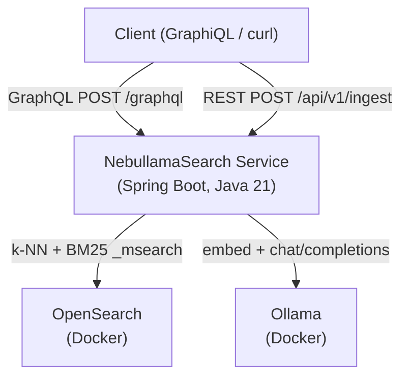
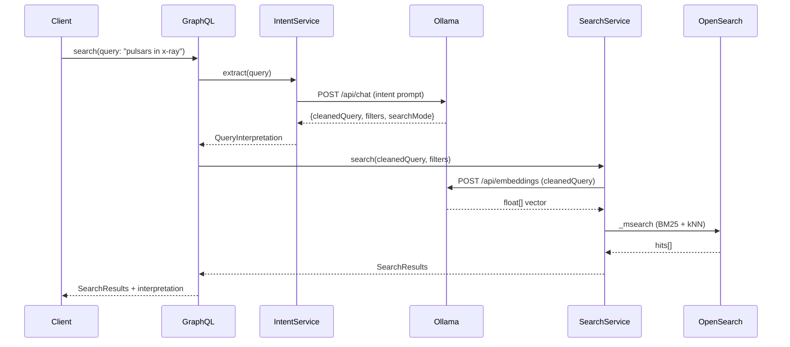
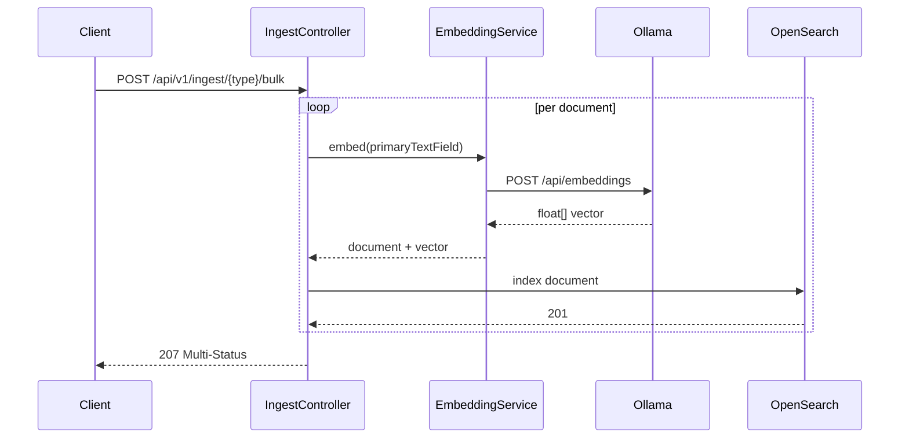
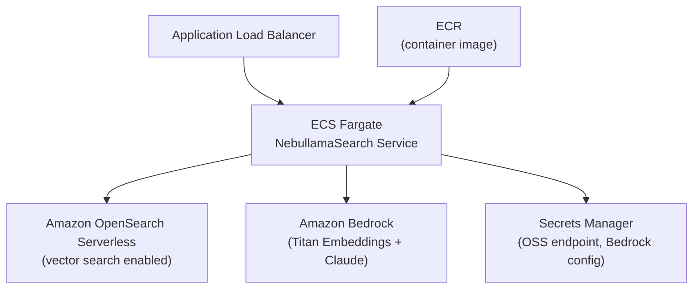

# NebullamaSearch — Project Requirements

## Overview

A local-dev Spring Boot HTTP service that exposes a GraphQL search API and a REST ingest API over five astronomy-themed OpenSearch indexes. Queries are handled via a hybrid search strategy: BM25 keyword matching combined with k-NN vector similarity using embeddings generated by a locally-running Ollama model. An LLM-powered intent extraction layer parses natural language queries into structured filters before search execution. The entire infrastructure stack (OpenSearch, Ollama) runs in Docker Compose; the Spring Boot service runs locally pointing at it.

---

## Goals

- Prototype cross-index global text search (single query, results from any/all indexes)
- Learn OpenSearch vector/k-NN features using `text_embedding` from Ollama
- Learn LLM-powered intent extraction for structured query building
- Provide a clean GraphQL API for search consumers and a REST API for data ingestion

---

## Infrastructure

### Docker Compose Stack

Services to define:

| Service | Image | Notes |
| --- | --- | --- |
| OpenSearch | `opensearchproject/opensearch:2.x` | Single node, no security plugin for local dev; named Docker volume mounted to `/usr/share/opensearch/data` for index persistence across restarts |
| OpenSearch Dashboards | `opensearchproject/opensearch-dashboards:2.x` | Optional but useful for index inspection |
| Ollama | `ollama/ollama` | Mount a volume for model persistence; pull model on startup via entrypoint script |

- The Spring Boot service is **not** in Docker Compose; it runs locally via `./gradlew bootRun`
- All ports exposed to `localhost` so the local service can connect without network config
- Ollama model to use: `nomic-embed-text` for embeddings; `mistral` or `llama3` for intent extraction (configurable via `application.yml`)
- Provide a `docker-compose.yml` and a `scripts/init.sh` that pulls required Ollama models after the container starts
- Define a named volume `opensearch-data` in `docker-compose.yml`; mount to `/usr/share/opensearch/data` on the OpenSearch container so index data and mappings survive `docker-compose down` and restart without re-ingestion

### OpenSearch Index Configuration

Each index must include:

- Standard analyzed text fields for BM25 (`keyword`, `name`, `description`, etc.)
- A `embedding` field of type `knn_vector` with dimension matching the chosen embedding model (768 for `nomic-embed-text`)
- Index settings enabling `knn: true`
- A shared `resource_type` field (value = index name) to support cross-index result unification

---

## Domain: Astronomy Resources

Five indexes representing distinct but interrelated astronomy resource types. Cross-index linkage is intentional — queries like "Crab Nebula" or "Hubble" should surface results from multiple indexes.

### 1. `celestial_objects`

Astronomical objects: stars, nebulae, galaxies, pulsars, black holes, star clusters, etc.

| Field | Type | Notes |
| --- | --- | --- |
| `id` | keyword | |
| `name` | text | Common name (e.g. "Crab Nebula") |
| `designations` | text[] | Catalog IDs: M1, NGC 1952, etc. |
| `object_type` | keyword | star, nebula, galaxy, pulsar, black_hole, cluster, etc. |
| `constellation` | keyword | |
| `distance_ly` | double | Distance in light years |
| `description` | text | Free text — primary embedding source |
| `discovered_by` | keyword | |
| `discovery_year` | integer | |
| `embedding` | knn_vector | |

### 2. `missions`

Space missions: past, present, and planned. NASA, ESA, JAXA, private.

| Field | Type | Notes |
| --- | --- | --- |
| `id` | keyword | |
| `name` | text | e.g. "Hubble Space Telescope", "Voyager 1" |
| `agency` | keyword | NASA, ESA, JAXA, SpaceX, etc. |
| `mission_type` | keyword | observatory, flyby, lander, rover, crewed, etc. |
| `launch_year` | integer | |
| `status` | keyword | active, retired, lost, planned |
| `targets` | keyword[] | e.g. ["Jupiter", "Europa"] — links to `celestial_objects` |
| `description` | text | |
| `embedding` | knn_vector | |

### 3. `observations`

Specific observational records: a telescope or instrument pointing at a target and producing data.

| Field | Type | Notes |
| --- | --- | --- |
| `id` | keyword | |
| `target_name` | text | Links conceptually to `celestial_objects.name` |
| `instrument` | keyword | e.g. "HST/ACS", "JWST/NIRCam", "VLA" |
| `observatory` | keyword | |
| `observation_date` | date | |
| `wavelength_band` | keyword | optical, infrared, radio, x-ray, gamma, uv |
| `notes` | text | Science notes — primary embedding source |
| `embedding` | knn_vector | |

### 4. `astronomers`

People: historical and contemporary astronomers, physicists, and cosmologists.

| Field | Type | Notes |
| --- | --- | --- |
| `id` | keyword | |
| `name` | text | |
| `birth_year` | integer | |
| `death_year` | integer | null if living |
| `nationality` | keyword | |
| `known_for` | text | e.g. "Discovery of pulsars, neutron star research" |
| `associated_objects` | keyword[] | Names of objects they discovered/studied |
| `associated_missions` | keyword[] | Mission names they contributed to |
| `biography` | text | Primary embedding source |
| `embedding` | knn_vector | |

### 5. `publications`

Scientific papers and books related to astronomy.

| Field | Type | Notes |
| --- | --- | --- |
| `id` | keyword | |
| `title` | text | |
| `authors` | keyword[] | |
| `year` | integer | |
| `journal` | keyword | e.g. "ApJ", "MNRAS", "Nature" |
| `abstract` | text | Primary embedding source |
| `topics` | keyword[] | e.g. ["neutron stars", "pulsar timing", "SNR"] |
| `doi` | keyword | |
| `embedding` | knn_vector | |

---

## Sample Data

Provide a `data/seed.json` (or per-index JSON files) with at least **10 documents per index** (50 total). Data should be realistic and intentionally cross-linked — e.g.:

- Crab Nebula appears in `celestial_objects`, referenced by observations, linked to a publication, and associated with an astronomer
- Hubble Space Telescope appears in `missions`, referenced in `observations.instrument`, and mentioned in `astronomers.associated_missions`
- A pulsar appears in `celestial_objects`, is the subject of a `publications` record, and was studied by an astronomer in `astronomers`

Seed data should be ingestible via the REST ingest endpoint.

### Seed Data Sourcing

All seed data is real; sourced from public APIs and Wikipedia. No synthetic or LLM-generated content.

| Index | Source |
| --- | --- |
| `celestial_objects` | [SIMBAD](http://simbad.cds.unistra.fr/simbad/) via TAP/ADQL — names, types, distances, designations, discovery info |
| `missions` | [NASA API](https://api.nasa.gov/) + Wikipedia infoboxes — name, agency, type, launch year, status, targets, description |
| `observations` | [MAST Portal](https://mast.stsci.edu/) — real HST/JWST observation records including instrument, date, wavelength band, proposal abstracts as notes |
| `astronomers` | Wikipedia article prose and infoboxes — biography, known_for, associated objects and missions |
| `publications` | [NASA ADS API](https://ui.adsabs.harvard.edu/help/api/) — real papers with title, authors, abstract, DOI, journal, year |

### Process

1. Choose a set of well-connected subjects (e.g. Crab Nebula, Cygnus X-1, Andromeda Galaxy) that have rich coverage across all five sources
2. Query each source for records related to those subjects to ensure cross-index linkage
3. Transform raw API responses into the target schema shape
4. Write final JSON to `data/seed_*.json`

`scripts/fetch_seed_data.py` automates steps 1–3. Wikipedia scraping can be done with `wikipedia-api` (Python). MAST and ADS both have well-documented REST APIs. No API key required for SIMBAD or MAST; ADS requires a free token.

---

## REST Ingest API

**Base path:** `/api/v1/ingest`

### Endpoints

#### `POST /api/v1/ingest/{resourceType}`

Ingest a single document into the specified index.

- `resourceType` path param must be one of: `celestial_objects`, `missions`, `observations`, `astronomers`, `publications`
- Request body: JSON matching the schema for that resource type (minus `embedding` — that is generated server-side)
- On receipt:
    1. Validate resource type
    2. Extract the primary text field(s) for embedding (configurable per resource type)
    3. Call Ollama embedding endpoint to generate vector
    4. Write document + vector to OpenSearch
- Response: `201 Created` with the document `id`

#### `POST /api/v1/ingest/{resourceType}/bulk`

Ingest a list of documents in one call. Same logic as single ingest, parallelized.

- Request body: JSON array of documents
- Response: `207 Multi-Status` with per-document success/failure

---

## GraphQL Search API

**Endpoint:** `POST /graphql`

### Schema

```graphql
type Query {
  # Cross-index global search
  search(input: SearchInput!): SearchResults!

  # Index-specific search (optional convenience)
  searchIndex(resourceType: ResourceType!, input: SearchInput!): SearchResults!
}

input SearchInput {
  query: String!
  filters: SearchFilters
  pagination: Pagination
}

input SearchFilters {
  resourceTypes: [ResourceType!]
  # Index-specific filters exposed as optional fields
  objectType: String        # celestial_objects
  agency: String            # missions
  status: String            # missions
  wavelengthBand: String    # observations
  journal: String           # publications
  nationality: String       # astronomers
  yearFrom: Int
  yearTo: Int
}

input Pagination {
  from: Int = 0
  size: Int = 10
}

enum ResourceType {
  CELESTIAL_OBJECTS
  MISSIONS
  OBSERVATIONS
  ASTRONOMERS
  PUBLICATIONS
}

type SearchResults {
  total: Int!
  hits: [SearchHit!]!
  interpretation: QueryInterpretation
}

type SearchHit {
  id: String!
  resourceType: ResourceType!
  score: Float!
  source: JSON!       # Raw document fields; use a scalar JSON type
}

type QueryInterpretation {
  rewrittenQuery: String
  extractedFilters: JSON
  searchMode: SearchMode!
}

enum SearchMode {
  KEYWORD
  SEMANTIC
  HYBRID
}
```

### Search Execution Pipeline

For every `search` call:

1. **Intent extraction** — send raw query string to Ollama (LLM) with a structured prompt; parse the response into extracted filters and a cleaned query string
2. **Query construction** — build an OpenSearch query combining:
    - BM25 `multi_match` on text fields using the cleaned query
    - k-NN `knn` query using an embedding of the cleaned query string
    - Any extracted structured filters as OpenSearch `filter` clauses
3. **Index targeting** — if `resourceTypes` filter is set, query only those indexes; otherwise query all five via multi-search (`_msearch`)
4. **Result unification** — merge and re-rank results from multiple indexes by score; return unified `SearchHit` list
5. **Response** — include `QueryInterpretation` showing what the LLM extracted, for transparency/debugging

### Intent Extraction Prompt Contract

The LLM call for intent extraction should:

- Use a system prompt that instructs the model to respond **only** with a JSON object
- Extract: `cleanedQuery` (string), `resourceTypeHints` (array), `filters` (object with any recognized field-level filters), `searchMode` suggestion (`keyword` | `semantic` | `hybrid`)
- Have a strict timeout; fall back to raw query + full hybrid search if LLM call fails or returns unparseable JSON

---

## Spring Boot Service

### Tech Stack

| Concern | Library/Approach |
| --- | --- |
| Framework | Spring Boot 3.x (Java 21) |
| GraphQL | `spring-boot-starter-graphql` (Spring for GraphQL) |
| OpenSearch client | `opensearch-java` (official OpenSearch Java client) |
| HTTP client for Ollama | Spring `RestClient` or `WebClient` |
| Build | Gradle (Kotlin DSL) |
| Config | `application.yml` with profiles: `local` (default) |

### `build.gradle.kts`

```kotlin
plugins {
    java
    id("org.springframework.boot") version "3.3.x"
    id("io.spring.dependency-management") version "1.1.x"
}

java {
    toolchain {
        languageVersion = JavaLanguageVersion.of(21)
    }
}

dependencies {
    implementation("org.springframework.boot:spring-boot-starter-graphql")
    implementation("org.springframework.boot:spring-boot-starter-web")
    implementation("org.opensearch.client:opensearch-java:2.x")
    implementation("com.fasterxml.jackson.core:jackson-databind")

    testImplementation("org.springframework.boot:spring-boot-starter-test")
    testImplementation("org.springframework:spring-webflux") // required for GraphQL test client
}
```

Enable virtual threads in `application.yml`:

```yaml
spring:
  threads:
    virtual:
      enabled: true
```

### Configuration (`application.yml`)

```yaml
opensearch:
  host: localhost
  port: 9200
  scheme: http

ollama:
  base-url: http://localhost:11434
  embedding-model: nomic-embed-text
  intent-model: mistral   # or llama3; swappable

search:
  hybrid-weight:
    bm25: 0.4
    knn: 0.6
  knn-k: 10
  intent-extraction:
    enabled: true
    timeout-ms: 3000
```

### Repository Structure

```text
nebullama-search/
├── .gitignore
├── README.md
├── docker-compose.yml
├── scripts/
│   ├── init.sh                  # pulls Ollama models after docker-compose up
│   └── fetch_seed_data.py       # fetches from SIMBAD/NASA/MAST/ADS; writes to data/
├── data/
│   ├── seed_celestial_objects.json
│   ├── seed_missions.json
│   ├── seed_observations.json
│   ├── seed_astronomers.json
│   └── seed_publications.json
├── docs/                        # Obsidian vault
│   ├── .obsidian/
│   │   └── app.json
│   ├── index.md
│   ├── assets/
│   │   ├── nebullama-icon.svg   # placeholder pixel art icon
│   │   └── nebullama-icon.png   # final Midjourney version (to be added)
│   ├── architecture/
│   ├── concepts/
│   ├── guides/
│   ├── api-reference/
│   └── deployment/
└── service/                     # Spring Boot application root
    ├── build.gradle.kts
    ├── settings.gradle.kts
    ├── gradlew
    ├── gradlew.bat
    ├── gradle/
    │   └── wrapper/
    │       ├── gradle-wrapper.jar
    │       └── gradle-wrapper.properties
    └── src/
        ├── main/
        │   ├── java/
        │   │   └── com/example/nebullamasearch/
        │   │       ├── NebullamaSearchApplication.java
        │   │       ├── config/
        │   │       ├── ingest/
        │   │       ├── search/
        │   │       ├── domain/
        │   │       └── util/
        │   └── resources/
        │       ├── application.yml
        │       └── graphql/
        │           └── schema.graphqls
        └── test/
            └── java/
                └── com/example/nebullamasearch/
```

### Package Structure

```text
com.example.nebullamasearch
├── config/          # OpenSearch client, Ollama client beans
├── ingest/          # REST controllers, ingest service, embedding service
├── search/          # GraphQL controllers, search service, intent extraction service
├── domain/          # Per-resource-type POJOs and index mapping constants
└── util/            # JSON helpers, shared types
```

---

## Developer Experience

- `docker-compose up -d` starts OpenSearch + Ollama
- `scripts/init.sh` pulls required Ollama models (run once after first `docker-compose up`)
- `./gradlew bootRun` starts the service on `localhost:8080`
- `POST /api/v1/ingest/celestial_objects/bulk` with `data/seed_celestial_objects.json` seeds the index
- GraphiQL available at `localhost:8080/graphiql` for interactive query development
- OpenSearch Dashboards at `localhost:5601` for index/mapping inspection

---

## Project Identity

### Icon / Logo

A placeholder pixel art SVG icon (`docs/assets/nebullama-icon.svg`) is included in the repo. It depicts a llama in a spacesuit with a gold reflective visor, a chest control panel, antenna, and nebula wisps in the background — 64x64 pixel art style, scales cleanly as a favicon or README badge.

### Midjourney prompt (for a polished final version)

> A cute llama wearing a NASA-style spacesuit with a gold reflective visor helmet, floating in deep space surrounded by a colorful nebula in purples, pinks, and teals. Pixel art style, 64x64 sprite, dark space background with scattered stars, retro game aesthetic, clean crisp pixels, warm gold visor reflection, small antenna on helmet, chest control panel with tiny colored lights. --style raw --ar 1:1 --v 6

**Vision:** the llama should feel like a mascot — approachable and slightly whimsical but grounded in the space aesthetic. The gold visor is the signature element; it should catch a subtle nebula reflection. Pixel art keeps it timeless and works at small sizes (favicon, README badge, UI header). Aim for 64x64 or 128x128 base resolution.

Once generated, save the final asset to `docs/assets/nebullama/nebullama-icon.png` and reference it in `docs/index.md` and the repo `README.md`.

---

## Out of Scope (for this iteration)

- Authentication / authorization
- Multi-tenancy
- Index lifecycle management
- Pagination cursors (offset pagination is fine for this iteration); OpenSearch scroll API pagination is a planned follow-on
- Mutations via GraphQL (ingest is REST only)
- Production deployment / TLS

---

## Documentation (Obsidian Vault)

All docs live in `docs/` at the repo root, structured as an Obsidian vault with `.obsidian/` config included. Mermaid diagrams render natively in Obsidian with the core Mermaid plugin enabled (configured in `.obsidian/`).

### Vault Structure

```text
docs/
├── .obsidian/
│   ├── app.json               # enable Mermaid, set default theme
│   └── plugins/               # core plugin config only; no community plugins required
├── index.md                   # vault home page; links to all sections
├── architecture/
│   ├── overview.md            # system architecture diagram + narrative
│   ├── search-pipeline.md     # search execution flow diagram
│   ├── ingest-pipeline.md     # ingest flow diagram
│   └── aws-architecture.md    # AWS deployment architecture diagram
├── concepts/
│   ├── hybrid-search.md       # BM25 + k-NN explained; why hybrid beats either alone
│   ├── vector-embeddings.md   # what embeddings are; how nomic-embed-text works; HNSW
│   └── intent-extraction.md   # how the LLM intent layer works; prompt contract; fallback behavior
├── guides/
│   ├── local-dev-setup.md     # getting the full stack running locally end to end
│   ├── frontend-dev-setup.md  # React app setup; Vite proxy config; running alongside the service
│   ├── running-searches.md    # how to use GraphQL API and the React UI; example queries
│   └── data-ingestion.md      # how to run fetch_seed_data.py and bulk ingest
├── api-reference/
│   ├── graphql-schema.md      # full annotated GraphQL schema
│   └── ingest-rest-api.md     # ingest endpoint reference with curl examples
└── deployment/
    └── aws.md                 # AWS deployment guide (Bedrock, OSS, ECS, etc.)
```

### Architecture Diagrams (Mermaid)

Each diagram lives in its own doc. Required diagrams:

**`architecture/overview.md`** — C4-style component diagram showing the full local stack:



**`architecture/search-pipeline.md`** — sequence diagram of a search request:



**`architecture/ingest-pipeline.md`** — sequence diagram of a bulk ingest request:



**`architecture/aws-architecture.md`** — AWS deployment diagram:



### Guide Content Requirements

### `guides/local-dev-setup.md`

- Prerequisites: Java 21, Docker, Docker Compose, Gradle, Node 20+
- Step by step: clone → `docker-compose up -d` → `scripts/init.sh` → `./gradlew bootRun`
- Verification: health check endpoint, GraphiQL at `localhost:8080/graphiql`, Dashboards at `localhost:5601`
- Troubleshooting: Ollama model not found, OpenSearch heap issues, port conflicts

### `guides/frontend-dev-setup.md`

- Prerequisites: Node 20+, npm
- Step by step: `cd frontend && npm install && npm run dev`
- Vite proxy config explained; why it is needed to avoid CORS in dev
- Verify the React app at `localhost:5173` with the Spring Boot service running

### `guides/running-searches.md`

- How to use the React UI: search bar, filter panel, result cards, detail view
- How to read the query interpretation panel (searchMode, extractedFilters, rewrittenQuery)
- How to open GraphiQL for raw query access
- Annotated example queries: bare string search, filtered search, single-index search
- curl equivalents for all GraphQL examples

### `guides/data-ingestion.md`

- How to run `scripts/fetch_seed_data.py` (dependencies, ADS token setup)
- How to bulk ingest each seed file via curl
- How to verify documents landed in OpenSearch Dashboards
- How to add new documents manually

### `api-reference/graphql-schema.md`

- Full GraphQL schema reproduced with field-level annotations
- Example query for each operation (`search`, `searchIndex`)
- `SearchMode` explanation (KEYWORD vs SEMANTIC vs HYBRID)
- `QueryInterpretation` fields explained

### `api-reference/ingest-rest-api.md`

- Endpoint table with method, path, request body, response
- Full curl examples for single and bulk ingest per resource type
- Field reference per resource type (which fields are required, which are optional)
- Error response shapes (invalid resource type, OpenSearch write failure)

### `concepts/hybrid-search.md`

- What BM25 is; term frequency, inverse document frequency, length normalization
- What k-NN vector search is; approximate nearest neighbors; HNSW; cosine similarity
- Why hybrid beats either alone; concrete astronomy examples (exact designation lookup vs semantic query)
- How scores are combined; the `hybrid-weight` config values and how to tune them

### `concepts/vector-embeddings.md`

- What an embedding is; high-dimensional space; geometric proximity as semantic similarity
- Why model choice matters; `nomic-embed-text` and why it is suited for retrieval
- Vector dimensions and why the index mapping must match the model (768 for `nomic-embed-text`; 1024 for Titan v2)
- How embeddings are generated at ingest time and query time; the Ollama API call

### `concepts/intent-extraction.md`

- What intent extraction does; raw query → structured filters + cleaned query
- The LLM prompt contract; why JSON-only output is required; example input/output
- Fallback behavior when the LLM times out or returns unparseable output
- How extracted filters map to OpenSearch filter clauses
- The `searchMode` hint and how the service uses it

### AWS Deployment Guide (`deployment/aws.md`)

Cover the following:

### Replacing Ollama with Bedrock

- Swap `ollama.base-url` config for Bedrock API endpoint
- Embeddings: use `amazon.titan-embed-text-v2` in place of `nomic-embed-text`
- Intent extraction: use `anthropic.claude-3-haiku` in place of `mistral`
- Note the dimension difference: Titan v2 produces 1024-dimension vectors; index mappings must match
- Spring Boot service needs `software.amazon.awssdk:bedrockruntime` dependency and IAM role with `bedrock:InvokeModel`

### Replacing OpenSearch (Docker) with OpenSearch Serverless

- Create a vector search collection in OSS
- Update `opensearch.host` to the OSS endpoint
- Auth switches from no-auth to SigV4; use `software.amazon.awssdk:opensearchserverless` + request signing interceptor on the `opensearch-java` client
- Index creation via OSS API (same mapping schema)

### ECS Fargate

- Dockerize the Spring Boot service: provide a `service/Dockerfile` using `eclipse-temurin:21-jre`
- Push image to ECR
- Task definition: env vars for OSS endpoint and Bedrock region pulled from Secrets Manager
- Service behind an ALB with health check on `/actuator/health`

### IAM

- Task role needs: `bedrock:InvokeModel`, `aoss:APIAccessAll` on the OSS collection
- No hardcoded credentials; use task role only

### Cost note

- OSS minimum billing is 2 OCUs (~$350/month); flag this clearly as not suitable for a hobby project at production scale; recommend keeping Docker OpenSearch for personal use

---

## Frontend

A React single-page application in `frontend/` at the repo root. Runs locally via Vite dev server pointing at the Spring Boot service on `localhost:8080`.

### Tech Stack

| Concern | Library/Approach |
| --- | --- |
| Framework | React 18 |
| Build tool | Vite |
| GraphQL client | Apollo Client |
| Styling | Tailwind CSS |
| Language | TypeScript |

### Repo Structure

```text
frontend/
├── index.html
├── package.json
├── vite.config.ts
├── tailwind.config.ts
├── tsconfig.json
└── src/
    ├── main.tsx
    ├── App.tsx
    ├── apollo.ts              # Apollo Client setup pointing at localhost:8080/graphql
    ├── components/
    │   ├── SearchBar.tsx
    │   ├── FilterPanel.tsx
    │   ├── ResultList.tsx
    │   ├── ResultCard.tsx
    │   ├── ResultDetail.tsx
    │   └── InterpretationPanel.tsx
    ├── graphql/
    │   └── queries.ts         # typed GraphQL query definitions
    └── types/
        └── index.ts           # SearchHit, SearchResults, QueryInterpretation types
```

### Features

### Search bar

- Single text input; submits on Enter or button click
- No required syntax; bare natural language works
- URL state: query string reflected in `?q=` so results are shareable/bookmarkable

### Resource type filter panel

- Checkbox group for the five resource types: `CELESTIAL_OBJECTS`, `MISSIONS`, `OBSERVATIONS`, `ASTRONOMERS`, `PUBLICATIONS`
- All checked by default (cross-index search); unchecking narrows results to selected indexes
- Filters passed as `resourceTypes` in `SearchFilters`

### Result list

- Paginated results (offset-based; 10 per page)
- Each result shown as a card with: resource type badge, name/title, relevance score, short excerpt from `source`
- Cards are clickable to open detail view

### Result detail view

- Slide-in panel or modal showing full `source` fields for the selected hit
- Fields rendered based on resource type (e.g. `constellation` + `distance_ly` for celestial objects; `authors` + `abstract` for publications)
- Resource type badge and score shown in header

### Query interpretation panel

- Shown below the search bar after every query
- Displays: `searchMode` (KEYWORD / SEMANTIC / HYBRID), `rewrittenQuery` if different from input, `extractedFilters` as a readable tag list
- Collapsible; useful for debugging and demonstrating the intent extraction layer

### Developer Experience

- `cd frontend && npm install && npm run dev` starts Vite dev server on `localhost:5173`
- Vite proxy configured to forward `/graphql` to `localhost:8080` to avoid CORS issues in dev
- Spring Boot service must be running separately via `./gradlew bootRun`

### Out of Scope (frontend)

- Authentication
- Dark/light mode toggle
- Mobile layout
- Production build pipeline / CDN deployment
