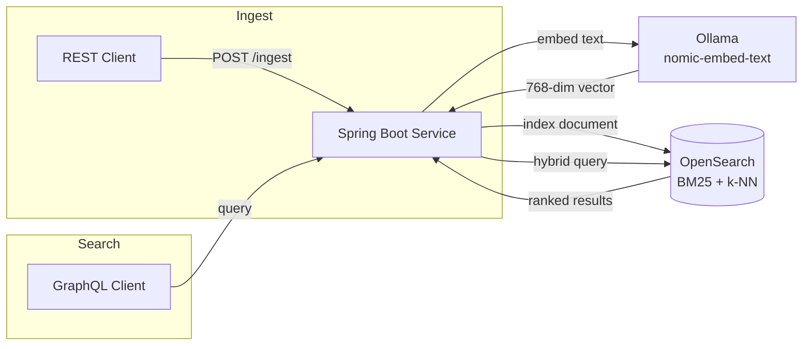

# Project Identity — Logo & README Implementation Plan

> **For agentic workers:** REQUIRED SUB-SKILL: Use superpowers:subagent-driven-development (recommended) or superpowers:executing-plans to implement this plan task-by-task. Steps use checkbox (`- [ ]`) syntax for tracking.

**Goal:** Wire the nebullama PNG mascot into the root README and docs vault home page, producing
a complete README with icon, badges, Mermaid architecture diagram, and quick start.

**Architecture:** The PNG at `assets/nebullama/llama-space-art-1774847580037.png` is renamed
to `assets/nebullama/nebullama-icon.png` for a stable, clean path. `README.md` is rewritten from
scratch. `docs/index.md` gets a one-line icon reference fix.

**Tech Stack:** Markdown, Mermaid, shields.io badges

---

## File Map

| File | Change |
| --- | --- |
| `assets/nebullama/nebullama-icon.png` | Renamed from `assets/nebullama/llama-space-art-1774847580037.png` |
| `README.md` | Full rewrite |
| `docs/index.md` | Line 3: `.svg` → `.png` |

---

## Tasks

---

### Task 1: Rename PNG asset

**Files:**

- Rename: `assets/nebullama/llama-space-art-1774847580037.png` →
  `assets/nebullama/nebullama-icon.png`

- [ ] **Step 1: Move the file with git**

```bash
git mv assets/nebullama/llama-space-art-1774847580037.png assets/nebullama/nebullama-icon.png
```

- [ ] **Step 2: Verify the rename**

```bash
ls assets/nebullama/nebullama-icon.png
```

Expected: `assets/nebullama/nebullama-icon.png`

- [ ] **Step 3: Commit**

```bash
git add assets/nebullama/nebullama-icon.png assets/nebullama/llama-space-art-1774847580037.png
git commit -m "Issue #3: rename mascot PNG to stable path"
```

---

### Task 2: Update docs/index.md icon reference

**Files:**

- Modify: `docs/index.md:3`

- [ ] **Step 1: Edit line 3 of docs/index.md**

Change:

```markdown

```

To:

```markdown

```

- [ ] **Step 2: Run markdownlint**

```bash
npx markdownlint-cli2 "docs/index.md"
```

Expected: `Summary: 0 error(s)`

- [ ] **Step 3: Commit**

```bash
git add docs/index.md
git commit -m "Issue #3: update docs/index.md icon reference to PNG"
```

---

### Task 3: Write README.md

**Files:**

- Modify: `README.md` (full rewrite — currently contains only `# nebullama-search`)

- [ ] **Step 1: Replace README.md with full content**

Write the following to `README.md`:

````markdown


# nebullama-search


A local-dev hybrid search service over astronomy data — a learning project for vector
search, OpenSearch k-NN, and LLM-powered intent extraction.

## Architecture



## Quick Start

**Prerequisites:** Java 21, Docker, Docker Compose

1. Start the infrastructure and pull Ollama models:

   ```bash
   docker-compose up -d
   ./scripts/init.sh
   ```

2. Start the service:

   ```bash
   cd service && ./gradlew bootRun
   ```

3. Verify:

   ```bash
   curl http://localhost:8080/actuator/health
   ```

   Expected: `{"status":"UP"}`

## Stack

| Concern | Technology |
| --- | --- |
| Service | Spring Boot 3.3, Java 21 |
| Search | OpenSearch 2.x (BM25 + k-NN) |
| Embeddings | Ollama + nomic-embed-text (768-dim) |
| Intent extraction | Ollama + mistral:7b |
| API | GraphQL (Spring for GraphQL) |
| Ingest | REST (Spring MVC) |
| Infrastructure | Docker Compose |

## Docs

Full documentation: [`docs/index.md`](docs/index.md)

````

- [ ] **Step 2: Run markdownlint**

```bash
npx markdownlint-cli2 "README.md"
```

Expected: `Summary: 0 error(s)`

- [ ] **Step 3: Commit**

```bash
git add README.md
git commit -m "Issue #3: add project README with icon, badges, and architecture diagram"
```
